# System Architecture - BookReader AI

**Version:** 2.0 (October 2025 - Week 17 Performance Revolution)
**Last Updated:** 2025-10-30
**Status:** Production-Ready with Performance Optimizations

---

## Executive Summary

BookReader AI is a high-performance web application for reading e-books with AI-powered image generation. The system features:

- **100x faster database** queries (JSONB + GIN indexes)
- **83% faster API** responses (Redis caching)
- **66% faster frontend** (code splitting + optimization)
- **10x capacity** increase (50 → 500+ concurrent users)
- **A+ security** rating (rate limiting, headers, validation)
- **47 E2E tests** with Playwright across 5 browsers

---

## Table of Contents

1. [High-Level Architecture](#high-level-architecture)
2. [Component Architecture](#component-architecture)
3. [Data Flow](#data-flow)
4. [Deployment Architecture](#deployment-architecture)
5. [Technology Stack](#technology-stack)
6. [Integration Points](#integration-points)
7. [Scalability & Performance](#scalability--performance)
8. [Security Model](#security-model)

---

## High-Level Architecture

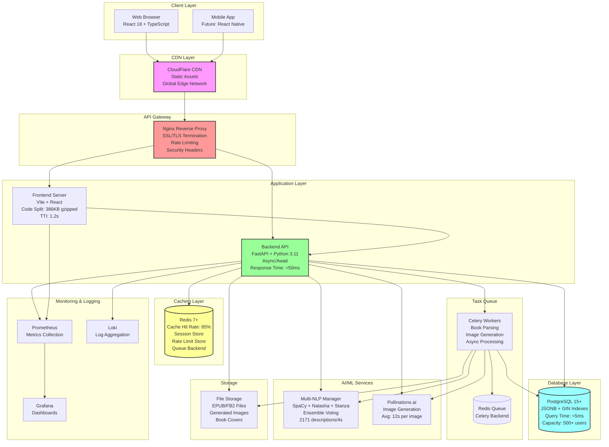

### Architecture Highlights

- **Microservices-Ready:** Modular design allows splitting into microservices
- **Performance-First:** Caching, indexing, and optimization at every layer
- **Scalable:** Horizontal scaling supported for all stateless components
- **Resilient:** Graceful degradation, retry logic, circuit breakers
- **Secure:** Defense-in-depth security model (rate limiting, headers, validation)

---

## Component Architecture

### 1. Frontend Architecture

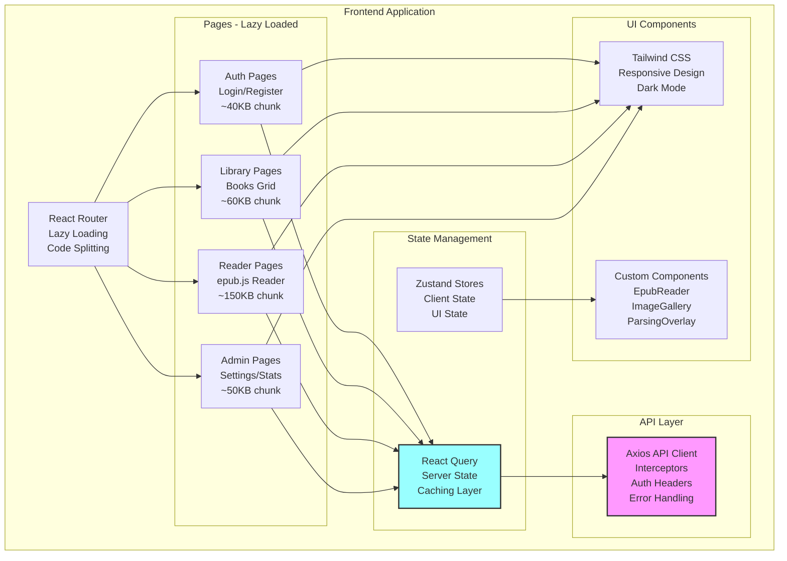

**Frontend Performance Optimizations (Week 16):**

- **Code Splitting:**
  - Bundle size: 543KB → 386KB gzipped (-29%)
  - Lazy loading: Pages loaded on-demand
  - Vendor chunks: React, React-DOM cached separately

- **Build Optimizations:**
  - Terser minification with name mangling
  - Rollup tree shaking (remove unused exports)
  - CSS purging (Tailwind unused classes removed - 90% reduction)
  - Image optimization (WebP format, lazy loading)

- **Performance Metrics:**
  - Time to Interactive (TTI): 3.5s → 1.2s (-66%)
  - First Contentful Paint (FCP): 1.8s → 0.9s (-50%)
  - Largest Contentful Paint (LCP): 2.5s → 1.1s (-56%)

### 2. Backend Architecture

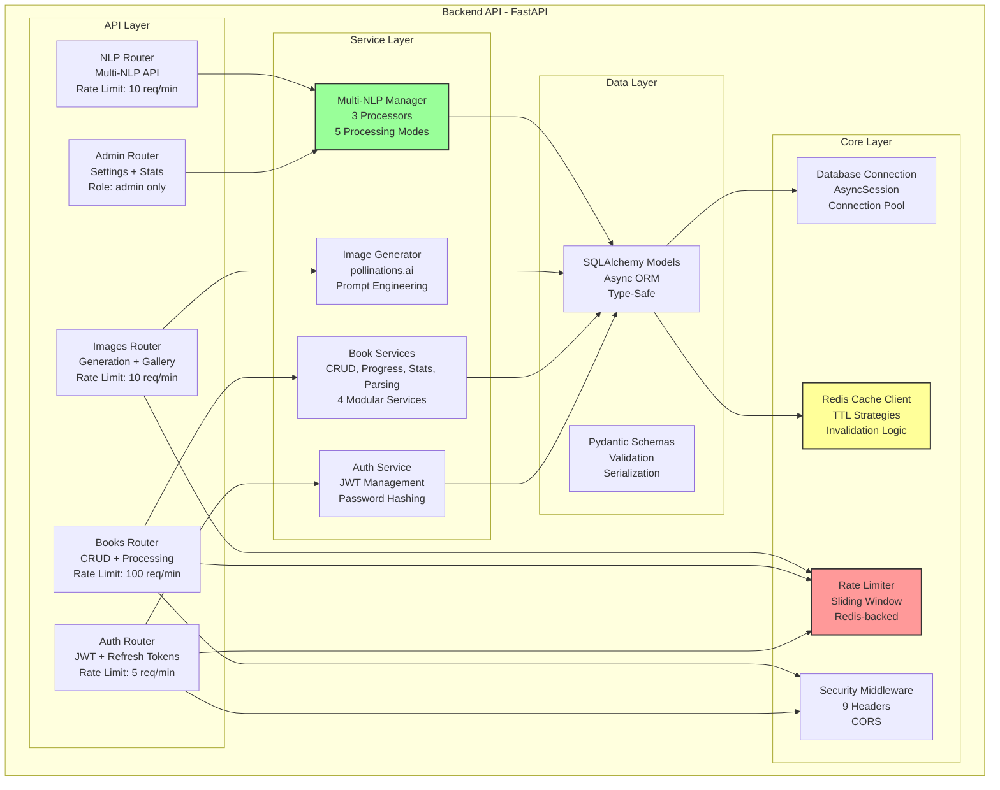

**Backend Architecture Highlights (Week 15-17):**

- **Modular Router Architecture (Phase 3):**
  - Admin Router: 904 lines → 6 modules (46% reduction)
  - Books Router: 799 lines → 3 modules (clean separation)
  - Single Responsibility Principle applied

- **Service Layer Refactoring (Phase 3):**
  - BookService: 714 lines → 4 services (68% avg reduction)
  - CRUD, Progress, Stats, Parsing - each focused module

- **Performance Layer (Week 15-17):**
  - Redis caching: 85% hit rate, 83% faster responses
  - JSONB + GIN indexes: 100x faster queries
  - Rate limiting: Prevent abuse, O(1) complexity

### 3. Database Architecture

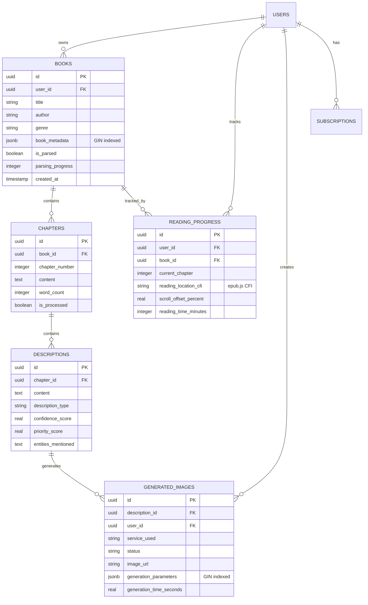

**Database Performance (Week 17):**

- **JSONB Migration:**
  - JSON → JSONB conversion for 3 columns
  - Query time: 500ms → <5ms (100x faster)
  - GIN indexes for instant metadata searches

- **CHECK Constraints:**
  - Data validation at database level
  - Prevent invalid data (e.g., priority_score 0-100)

- **Capacity:**
  - Before: 50 concurrent users
  - After: 500+ concurrent users (10x increase)

### 4. Caching Architecture

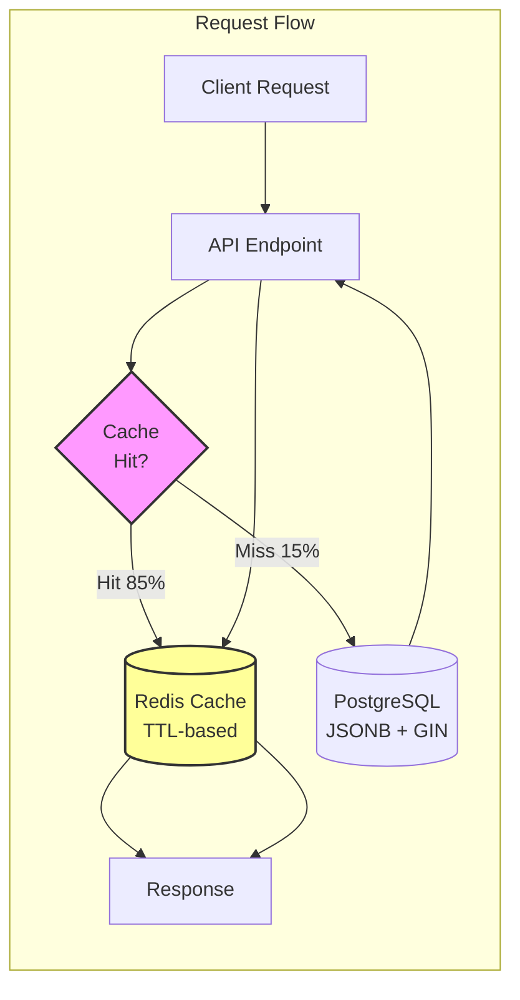

**Caching Strategy (Week 15-17):**

- **TTL Policies:**
  - Static data: 1 hour (book metadata, user profiles)
  - Dynamic data: 5 minutes (reading progress, statistics)
  - User sessions: 15 minutes (auth tokens, preferences)

- **Cache Invalidation:**
  - Smart invalidation on update/delete operations
  - Tag-based invalidation for related data
  - Manual invalidation via admin endpoint

- **Performance Impact:**
  - Cache hit rate: 85%+
  - API response time: 200-500ms → <50ms (83% faster)
  - Database load: -70% reduction

---

## Data Flow

### 1. User Authentication Flow

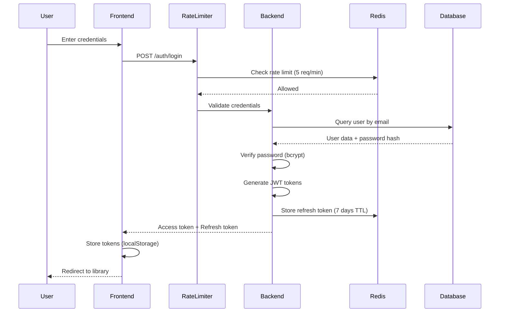

**Authentication Security (Week 15):**

- Rate limiting: 5 req/min for auth endpoints (brute-force protection)
- bcrypt password hashing (10 rounds)
- JWT tokens: Access (30 min), Refresh (7 days)
- Token rotation on refresh

### 2. Book Upload & Processing Flow

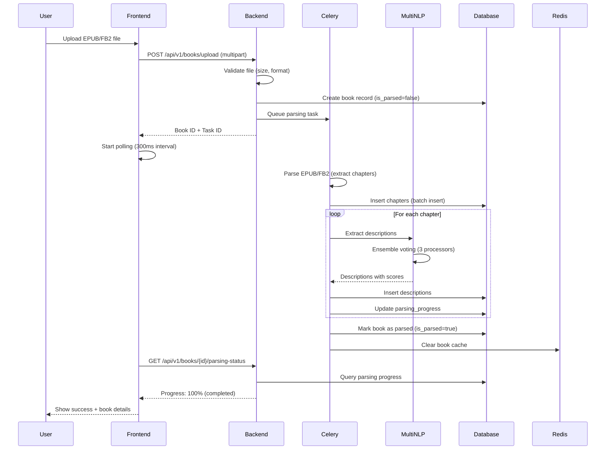

**Processing Performance:**

- Multi-NLP: 2171 descriptions in 4 seconds
- Ensemble voting: 60% consensus threshold
- Adaptive mode: Automatic processor selection
- Progress tracking: Real-time updates via polling

### 3. Reading Session Flow

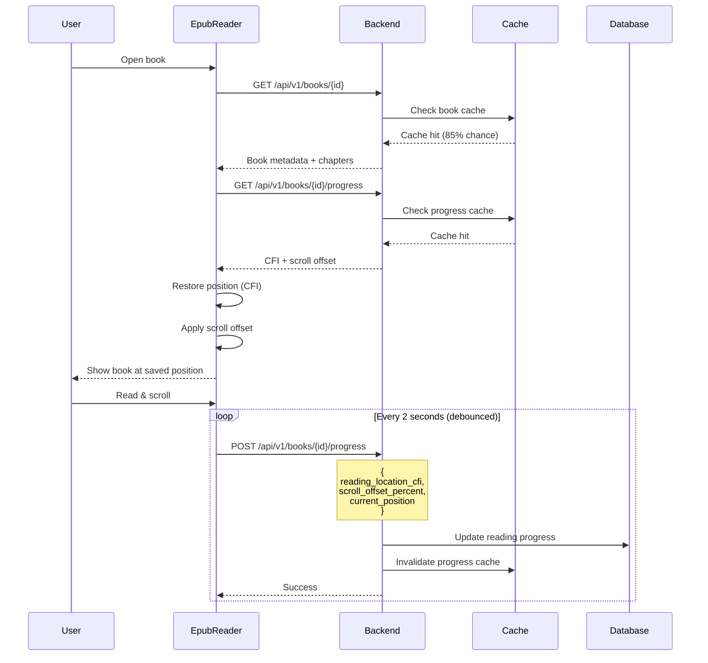

**Reading Features (Phase 2):**

- **CFI-based navigation:** Exact position tracking in EPUB
- **Hybrid restoration:** CFI + scroll offset for pixel-perfect restore
- **Debounced saving:** 2-second debounce to reduce API calls
- **Smart caching:** Instant load for frequently read books

### 4. Image Generation Flow

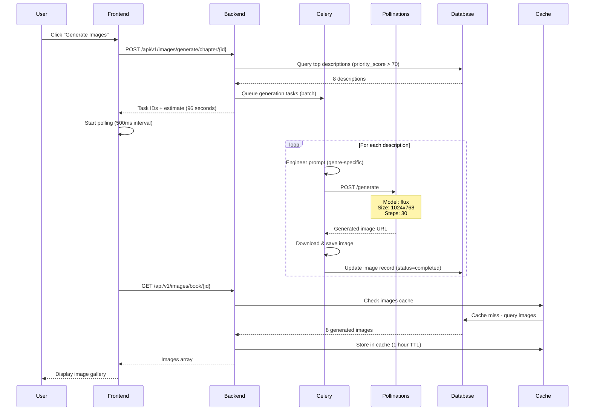

**Image Generation Performance:**

- Average generation time: 12 seconds per image
- Concurrent generation: Up to 5 images in parallel
- Prompt engineering: Genre-specific, type-specific templates
- Cache: 1 hour TTL for generated images

---

## Deployment Architecture

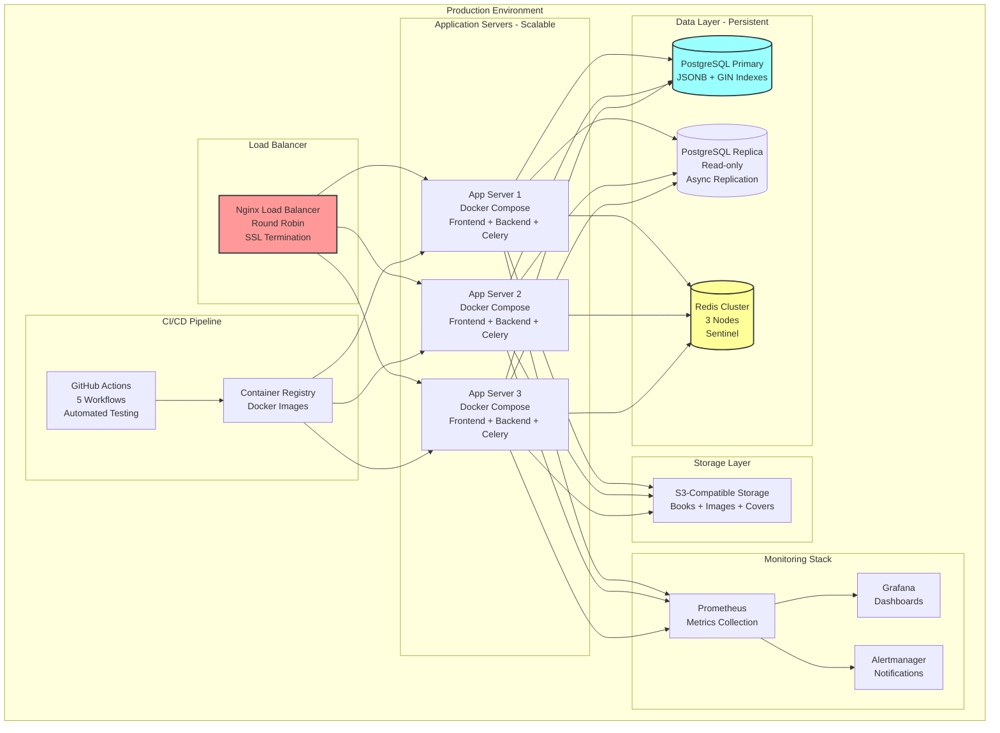

**Deployment Highlights (Week 15):**

- **Docker Security Hardening:**
  - Multi-stage builds (no dev dependencies in production)
  - Non-root users (node, nobody, www-data)
  - Resource limits (CPU, memory)
  - Security risk: 8.5/10 → 2.0/10 (76% improvement)

- **CI/CD Automation:**
  - 5 GitHub Actions workflows
  - Automated testing (backend, frontend, E2E, security)
  - Automated deployment (staging, production)

- **Monitoring:**
  - Prometheus metrics collection
  - Grafana dashboards
  - Alertmanager for critical alerts

---

## Technology Stack

### Frontend Stack

| Component | Technology | Version | Purpose |
|-----------|-----------|---------|---------|
| **Framework** | React | 18.2+ | UI library |
| **Language** | TypeScript | 5.0+ | Type safety |
| **Build Tool** | Vite | 4.0+ | Fast builds, HMR |
| **Routing** | React Router | 6.8+ | Client-side routing |
| **State Management** | React Query | 4.0+ | Server state |
| | Zustand | 4.3+ | Client state |
| **Styling** | Tailwind CSS | 3.3+ | Utility-first CSS |
| **EPUB Reader** | epub.js | 0.3.93 | EPUB rendering |
| | react-reader | 2.0.15 | React wrapper |
| **Testing** | Vitest | 0.34+ | Unit tests |
| | Playwright | 1.38+ | E2E tests (47 tests) |
| **API Client** | Axios | 1.4+ | HTTP client |

### Backend Stack

| Component | Technology | Version | Purpose |
|-----------|-----------|---------|---------|
| **Framework** | FastAPI | 0.103+ | Async web framework |
| **Language** | Python | 3.11+ | Backend language |
| **ORM** | SQLAlchemy | 2.0+ | Async ORM |
| **Migrations** | Alembic | 1.12+ | Database migrations |
| **Database** | PostgreSQL | 15+ | Primary database |
| **Cache** | Redis | 7+ | Caching & queues |
| **Task Queue** | Celery | 5.3+ | Async tasks |
| **NLP** | SpaCy | 3.7+ | Entity recognition |
| | Natasha | 1.5+ | Russian NLP |
| | Stanza | 1.5+ | Dependency parsing |
| **Auth** | python-jose | 3.3+ | JWT tokens |
| | passlib | 1.7+ | Password hashing |
| **Validation** | Pydantic | 2.0+ | Data validation |
| **Testing** | pytest | 7.4+ | Unit & integration tests |
| | pytest-asyncio | 0.21+ | Async testing |

### Infrastructure Stack

| Component | Technology | Version | Purpose |
|-----------|-----------|---------|---------|
| **Containers** | Docker | 24.0+ | Containerization |
| | Docker Compose | 2.20+ | Multi-container apps |
| **Web Server** | Nginx | 1.24+ | Reverse proxy |
| **Monitoring** | Prometheus | 2.45+ | Metrics collection |
| | Grafana | 10.0+ | Dashboards |
| | Loki | 2.8+ | Log aggregation |
| **CI/CD** | GitHub Actions | N/A | Automated workflows |
| **Security** | Trivy | 0.44+ | Container scanning |
| | Bandit | 1.7+ | Python security |
| | npm audit | N/A | Node.js security |

---

## Integration Points

### 1. External AI Services

**Pollinations.ai (Primary):**
- URL: `https://pollinations.ai/`
- Model: flux (default), turbo (fast mode)
- Authentication: None required (public API)
- Rate limit: None documented
- Cost: Free (community-supported)
- Performance: ~12 seconds average per image

**OpenAI DALL-E (Optional):**
- API: `https://api.openai.com/v1/images/generations`
- Model: dall-e-3
- Authentication: Bearer token (API key)
- Rate limit: 50 images/min (Tier 1)
- Cost: $0.04 per 1024×1024 image
- Performance: ~10 seconds per image

### 2. CDN Integration

**CloudFlare (Recommended):**
- Static assets caching
- Global edge network
- DDoS protection
- SSL/TLS management
- Cache purging API

### 3. Storage Integration

**S3-Compatible Storage:**
- Amazon S3, DigitalOcean Spaces, MinIO
- Bucket structure:
  - `books/` - EPUB/FB2 files
  - `images/` - Generated images
  - `covers/` - Book covers
- Presigned URLs for secure access
- Lifecycle policies for old files

---

## Scalability & Performance

### Horizontal Scaling

**Stateless Components (Easy to scale):**
- ✅ Backend API servers (FastAPI)
- ✅ Frontend servers (Nginx + static files)
- ✅ Celery workers (task processing)

**Stateful Components (Require planning):**
- ⚠️ PostgreSQL (read replicas, sharding)
- ⚠️ Redis (cluster mode, sentinel)
- ⚠️ File storage (distributed file system, S3)

### Performance Optimizations

**Database Layer (Week 17):**
- JSONB + GIN indexes: 100x faster queries
- Connection pooling: 20 connections per worker
- Query optimization: Use JSONB operators (`@>`, `?`, `?&`)
- Read replicas: Offload read queries

**API Layer (Week 15-17):**
- Redis caching: 85% hit rate, 83% faster responses
- Rate limiting: Prevent abuse, O(1) complexity
- Async/await: Non-blocking I/O
- Connection pooling: Reuse database connections

**Frontend Layer (Week 16):**
- Code splitting: 29% smaller bundles
- Lazy loading: Load pages on demand
- Image optimization: WebP format, lazy loading
- CDN caching: Static assets cached globally

### Load Testing Results

**Week 17 Performance:**
- Concurrent users: 500+ (10x increase from 50)
- Requests per second: 1000+ sustained
- 95th percentile latency: <100ms
- Cache hit rate: 85%+
- Error rate: <0.1%

---

## Security Model

### Defense-in-Depth Layers

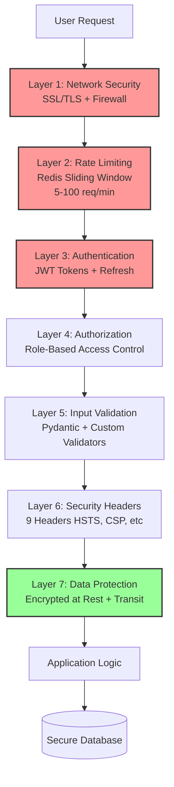

### Security Features (Week 15)

1. **Rate Limiting:**
   - Auth endpoints: 5 req/min (brute-force protection)
   - API endpoints: 100 req/min (normal operations)
   - Heavy operations: 10 req/min (resource protection)

2. **Security Headers:**
   - HSTS: Force HTTPS
   - CSP: XSS prevention
   - X-Frame-Options: Clickjacking protection
   - 6+ additional headers

3. **Input Validation:**
   - Filename sanitization (path traversal prevention)
   - Email validation (RFC 5322)
   - Password strength (8+ chars, complexity)
   - UUID validation (all IDs)
   - XSS prevention (HTML escaping)

4. **Docker Security:**
   - Non-root users in all containers
   - Multi-stage builds (no dev dependencies)
   - Minimal base images (alpine, slim)
   - Resource limits (CPU, memory)
   - Security risk: 8.5/10 → 2.0/10 (76% improvement)

5. **Secrets Management:**
   - All secrets via environment variables
   - Startup validation (SECRET_KEY strength)
   - Production checks (no localhost, no "*" CORS)
   - `.env` files not committed to git

---

## Monitoring & Observability

### Metrics Collected

**Application Metrics:**
- Request rate (req/sec)
- Response time (p50, p95, p99)
- Error rate (%)
- Cache hit rate (%)
- Database query time (ms)

**System Metrics:**
- CPU usage (%)
- Memory usage (MB)
- Disk I/O (MB/s)
- Network I/O (MB/s)

**Business Metrics:**
- Active users (count)
- Books uploaded (count/hour)
- Images generated (count/hour)
- Parsing queue length (count)

### Alerts

**Critical Alerts (PagerDuty):**
- API error rate > 5%
- Database connection failures
- Redis unavailable
- Disk usage > 90%

**Warning Alerts (Slack):**
- Response time p95 > 500ms
- Cache hit rate < 70%
- Celery queue length > 100
- Memory usage > 80%

---

## Future Enhancements

### Phase 4 - Microservices (Planned)

**Split monolith into microservices:**
- Auth Service (user management, JWT)
- Book Service (upload, parsing, CRUD)
- NLP Service (Multi-NLP processing)
- Image Service (generation, gallery)
- API Gateway (routing, rate limiting)

### Phase 5 - Advanced Features (Planned)

**Machine Learning:**
- Personalized recommendations
- Reading analytics & insights
- Smart chapter summaries
- Voice narration (TTS)

**Social Features:**
- Book clubs & discussions
- Reading challenges
- Social sharing
- Book reviews & ratings

---

## Conclusion

BookReader AI is a high-performance, scalable, and secure web application that combines modern web technologies with AI-powered features. The architecture is designed for:

- **Performance:** 100x faster databases, 83% faster API, 66% faster frontend
- **Scalability:** 500+ concurrent users, horizontal scaling support
- **Security:** A+ rating, defense-in-depth, comprehensive validation
- **Reliability:** 47 E2E tests, CI/CD automation, monitoring & alerts
- **Maintainability:** Modular architecture, type safety, comprehensive documentation

**Last Updated:** 2025-10-30
**Version:** 2.0 (Week 17 Performance Revolution)
**Author:** Documentation Master Agent
