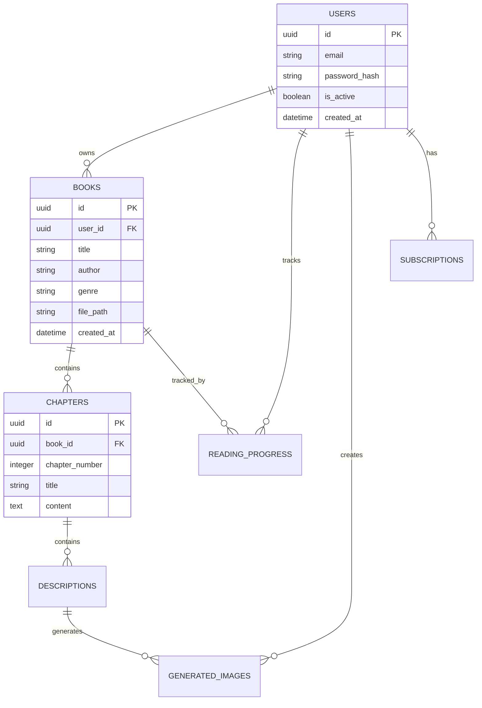

# Database Schema - BookReader AI

Полная схема базы данных PostgreSQL для BookReader AI с описанием всех таблиц, связей и индексов.

## Обзор архитектуры

BookReader AI использует PostgreSQL 15+ с SQLAlchemy ORM для управления данными. Схема спроектирована для:

- **Высокой производительности** - оптимизированные индексы и отношения
- **Масштабируемости** - UUID первичные ключи, правильная нормализация
- **Целостности данных** - foreign key constraints, каскадные удаления
- **Аналитики** - временные метки для всех операций

## Диаграмма связей



## Основные таблицы

### 1. Users - Пользователи системы

**Назначение:** Хранение информации о пользователях и их аутентификации.

```sql
CREATE TABLE users (
    id UUID PRIMARY KEY DEFAULT gen_random_uuid(),
    email VARCHAR(255) UNIQUE NOT NULL,
    password_hash VARCHAR(255) NOT NULL,
    full_name VARCHAR(255),
    is_active BOOLEAN DEFAULT true NOT NULL,
    is_superuser BOOLEAN DEFAULT false NOT NULL,
    email_verified BOOLEAN DEFAULT false NOT NULL,
    
    -- Настройки читалки
    reader_settings JSONB DEFAULT '{}',
    
    -- Временные метки
    created_at TIMESTAMP WITH TIME ZONE DEFAULT NOW() NOT NULL,
    updated_at TIMESTAMP WITH TIME ZONE DEFAULT NOW() NOT NULL,
    last_login_at TIMESTAMP WITH TIME ZONE
);

-- Индексы
CREATE INDEX idx_users_email ON users(email);
CREATE INDEX idx_users_active ON users(is_active);
CREATE INDEX idx_users_created_at ON users(created_at);
```

**Поля:**
- `id` - UUID, первичный ключ
- `email` - email пользователя (уникальный)
- `password_hash` - bcrypt хеш пароля
- `full_name` - полное имя пользователя
- `is_active` - активность аккаунта
- `is_superuser` - права администратора
- `reader_settings` - JSON настройки читалки (тема, шрифт и т.д.)

**Связи:**
- `users.books` → многие книги
- `users.reading_progress` → многие записи прогресса
- `users.generated_images` → многие изображения

### 2. Subscriptions - Подписки пользователей

**Назначение:** Управление планами подписок и лимитами.

```sql
CREATE TABLE subscriptions (
    id UUID PRIMARY KEY DEFAULT gen_random_uuid(),
    user_id UUID NOT NULL REFERENCES users(id) ON DELETE CASCADE,
    
    plan_type VARCHAR(20) DEFAULT 'FREE' NOT NULL, -- FREE, PREMIUM, ULTIMATE
    status VARCHAR(20) DEFAULT 'ACTIVE' NOT NULL,  -- ACTIVE, CANCELLED, EXPIRED
    
    -- Лимиты
    books_limit INTEGER DEFAULT 5 NOT NULL,
    images_per_month INTEGER DEFAULT 50 NOT NULL,
    priority_generation BOOLEAN DEFAULT false NOT NULL,
    
    -- Биллинг
    price_per_month DECIMAL(10,2) DEFAULT 0.00,
    currency VARCHAR(3) DEFAULT 'USD',
    
    -- Временные метки
    started_at TIMESTAMP WITH TIME ZONE DEFAULT NOW() NOT NULL,
    expires_at TIMESTAMP WITH TIME ZONE,
    cancelled_at TIMESTAMP WITH TIME ZONE,
    created_at TIMESTAMP WITH TIME ZONE DEFAULT NOW() NOT NULL,
    updated_at TIMESTAMP WITH TIME ZONE DEFAULT NOW() NOT NULL
);

-- Индексы
CREATE INDEX idx_subscriptions_user_id ON subscriptions(user_id);
CREATE INDEX idx_subscriptions_status ON subscriptions(status);
CREATE INDEX idx_subscriptions_expires_at ON subscriptions(expires_at);
```

### 3. Books - Книги в системе

**Назначение:** Хранение информации о загруженных книгах и их метаданных.

```sql
CREATE TABLE books (
    id UUID PRIMARY KEY DEFAULT gen_random_uuid(),
    user_id UUID NOT NULL REFERENCES users(id) ON DELETE CASCADE,
    
    -- Основная информация
    title VARCHAR(500) NOT NULL,
    author VARCHAR(255),
    genre VARCHAR(50) DEFAULT 'other' NOT NULL,
    language VARCHAR(10) DEFAULT 'ru' NOT NULL,
    
    -- Файл
    file_path VARCHAR(1000) NOT NULL,
    file_format VARCHAR(10) NOT NULL, -- epub, fb2
    file_size INTEGER NOT NULL,
    
    -- Контент
    cover_image VARCHAR(1000),
    description TEXT,
    book_metadata JSONB, -- метаданные из файла
    
    -- Статистика
    total_pages INTEGER DEFAULT 0 NOT NULL,
    estimated_reading_time INTEGER DEFAULT 0 NOT NULL, -- минуты
    
    -- Статус обработки
    is_parsed BOOLEAN DEFAULT false NOT NULL,
    parsing_progress INTEGER DEFAULT 0 NOT NULL, -- 0-100%
    parsing_error TEXT,
    
    -- Временные метки
    created_at TIMESTAMP WITH TIME ZONE DEFAULT NOW() NOT NULL,
    updated_at TIMESTAMP WITH TIME ZONE DEFAULT NOW() NOT NULL,
    last_accessed TIMESTAMP WITH TIME ZONE
);

-- Индексы
CREATE INDEX idx_books_user_id ON books(user_id);
CREATE INDEX idx_books_title ON books(title);
CREATE INDEX idx_books_author ON books(author);
CREATE INDEX idx_books_genre ON books(genre);
CREATE INDEX idx_books_is_parsed ON books(is_parsed);
CREATE INDEX idx_books_created_at ON books(created_at);
```

**Enums:**
```sql
-- Форматы книг
CREATE TYPE book_format AS ENUM ('epub', 'fb2');

-- Жанры книг (влияют на стиль генерации изображений)
CREATE TYPE book_genre AS ENUM (
    'fantasy', 'detective', 'science_fiction', 'historical', 
    'romance', 'thriller', 'horror', 'classic', 'other'
);
```

### 4. Chapters - Главы книг

**Назначение:** Хранение содержимого глав книг после парсинга.

```sql
CREATE TABLE chapters (
    id UUID PRIMARY KEY DEFAULT gen_random_uuid(),
    book_id UUID NOT NULL REFERENCES books(id) ON DELETE CASCADE,
    
    -- Структура
    chapter_number INTEGER NOT NULL,
    title VARCHAR(500),
    content TEXT NOT NULL,
    
    -- Статистика
    word_count INTEGER DEFAULT 0 NOT NULL,
    estimated_reading_time INTEGER DEFAULT 0 NOT NULL, -- минуты
    
    -- Обработка
    is_processed BOOLEAN DEFAULT false NOT NULL,
    processing_error TEXT,
    
    -- Временные метки
    created_at TIMESTAMP WITH TIME ZONE DEFAULT NOW() NOT NULL,
    updated_at TIMESTAMP WITH TIME ZONE DEFAULT NOW() NOT NULL
);

-- Индексы и ограничения
CREATE INDEX idx_chapters_book_id ON chapters(book_id);
CREATE INDEX idx_chapters_number ON chapters(chapter_number);
CREATE INDEX idx_chapters_is_processed ON chapters(is_processed);
CREATE UNIQUE INDEX idx_chapters_book_number ON chapters(book_id, chapter_number);
```

### 5. Descriptions - Найденные описания

**Назначение:** Хранение описаний, извлеченных NLP процессором из текста книг.

```sql
CREATE TABLE descriptions (
    id UUID PRIMARY KEY DEFAULT gen_random_uuid(),
    chapter_id UUID NOT NULL REFERENCES chapters(id) ON DELETE CASCADE,
    
    -- Контент
    content TEXT NOT NULL,
    context TEXT, -- окружающий контекст
    
    -- Классификация
    description_type VARCHAR(20) NOT NULL, -- location, character, atmosphere, object, action
    confidence_score REAL DEFAULT 0.0 NOT NULL,
    priority_score REAL DEFAULT 0.0 NOT NULL, -- для очереди генерации
    
    -- Метаданные NLP
    entities_mentioned TEXT, -- список найденных сущностей
    sentiment_score REAL DEFAULT 0.0,
    text_position_start INTEGER,
    text_position_end INTEGER,
    
    -- Временные метки
    created_at TIMESTAMP WITH TIME ZONE DEFAULT NOW() NOT NULL,
    updated_at TIMESTAMP WITH TIME ZONE DEFAULT NOW() NOT NULL
);

-- Индексы
CREATE INDEX idx_descriptions_chapter_id ON descriptions(chapter_id);
CREATE INDEX idx_descriptions_type ON descriptions(description_type);
CREATE INDEX idx_descriptions_priority ON descriptions(priority_score DESC);
CREATE INDEX idx_descriptions_confidence ON descriptions(confidence_score DESC);
CREATE INDEX idx_descriptions_created_at ON descriptions(created_at);

-- Полнотекстовый поиск
CREATE INDEX idx_descriptions_content_fts ON descriptions USING GIN(to_tsvector('russian', content));
```

**Enums:**
```sql
-- Типы описаний с приоритетами
CREATE TYPE description_type AS ENUM (
    'location',    -- 75% приоритет
    'character',   -- 60% приоритет
    'atmosphere',  -- 45% приоритет  
    'object',      -- 40% приоритет
    'action'       -- 30% приоритет
);
```

### 6. Generated Images - Сгенерированные изображения

**Назначение:** Хранение информации о сгенерированных AI изображениях.

```sql
CREATE TABLE generated_images (
    id UUID PRIMARY KEY DEFAULT gen_random_uuid(),
    description_id UUID NOT NULL REFERENCES descriptions(id) ON DELETE CASCADE,
    user_id UUID NOT NULL REFERENCES users(id) ON DELETE CASCADE,
    
    -- AI сервис
    service_used VARCHAR(50) NOT NULL, -- pollinations, openai, etc
    model_version VARCHAR(100),
    status VARCHAR(20) DEFAULT 'pending' NOT NULL, -- pending, generating, completed, failed
    
    -- Результат
    image_url VARCHAR(1000),
    local_path VARCHAR(1000),
    prompt_used TEXT,
    negative_prompt TEXT,
    
    -- Метаданные
    generation_time_seconds REAL,
    image_width INTEGER,
    image_height INTEGER,
    file_size INTEGER,
    
    -- Ошибки
    error_message TEXT,
    retry_count INTEGER DEFAULT 0,
    
    -- Временные метки
    created_at TIMESTAMP WITH TIME ZONE DEFAULT NOW() NOT NULL,
    updated_at TIMESTAMP WITH TIME ZONE DEFAULT NOW() NOT NULL,
    completed_at TIMESTAMP WITH TIME ZONE
);

-- Индексы
CREATE INDEX idx_generated_images_description_id ON generated_images(description_id);
CREATE INDEX idx_generated_images_user_id ON generated_images(user_id);
CREATE INDEX idx_generated_images_status ON generated_images(status);
CREATE INDEX idx_generated_images_service ON generated_images(service_used);
CREATE INDEX idx_generated_images_created_at ON generated_images(created_at);
```

### 7. Reading Progress - Прогресс чтения

**Назначение:** Отслеживание прогресса чтения книг пользователями.

```sql
CREATE TABLE reading_progress (
    id UUID PRIMARY KEY DEFAULT gen_random_uuid(),
    user_id UUID NOT NULL REFERENCES users(id) ON DELETE CASCADE,
    book_id UUID NOT NULL REFERENCES books(id) ON DELETE CASCADE,
    
    -- Позиция чтения
    current_chapter INTEGER DEFAULT 1 NOT NULL,
    current_page INTEGER DEFAULT 1 NOT NULL,
    current_position INTEGER DEFAULT 0 NOT NULL, -- позиция в главе
    
    -- Статистика чтения
    reading_time_minutes INTEGER DEFAULT 0 NOT NULL,
    reading_speed_wpm REAL DEFAULT 0.0 NOT NULL,
    
    -- Временные метки
    created_at TIMESTAMP WITH TIME ZONE DEFAULT NOW() NOT NULL,
    updated_at TIMESTAMP WITH TIME ZONE DEFAULT NOW() NOT NULL,
    last_read_at TIMESTAMP WITH TIME ZONE DEFAULT NOW() NOT NULL
);

-- Индексы и ограничения
CREATE INDEX idx_reading_progress_user_id ON reading_progress(user_id);
CREATE INDEX idx_reading_progress_book_id ON reading_progress(book_id);
CREATE INDEX idx_reading_progress_last_read ON reading_progress(last_read_at DESC);
CREATE UNIQUE INDEX idx_reading_progress_user_book ON reading_progress(user_id, book_id);
```

## Представления (Views)

### 1. user_reading_stats - Статистика чтения пользователей

```sql
CREATE VIEW user_reading_stats AS
SELECT 
    u.id as user_id,
    u.full_name,
    COUNT(DISTINCT b.id) as total_books,
    COUNT(DISTINCT CASE WHEN rp.current_chapter > 1 THEN b.id END) as started_books,
    SUM(rp.reading_time_minutes) as total_reading_time,
    AVG(rp.reading_speed_wpm) as avg_reading_speed,
    COUNT(DISTINCT gi.id) as total_generated_images
FROM users u
LEFT JOIN books b ON u.id = b.user_id
LEFT JOIN reading_progress rp ON u.id = rp.user_id
LEFT JOIN generated_images gi ON u.id = gi.user_id
GROUP BY u.id, u.full_name;
```

### 2. book_popularity - Популярность книг

```sql
CREATE VIEW book_popularity AS
SELECT 
    b.id,
    b.title,
    b.author,
    b.genre,
    COUNT(DISTINCT rp.user_id) as readers_count,
    AVG(
        CASE 
            WHEN total_chapters.chapter_count > 0 
            THEN (rp.current_chapter::float / total_chapters.chapter_count) * 100
            ELSE 0
        END
    ) as avg_completion_percent,
    COUNT(DISTINCT gi.id) as total_images_generated
FROM books b
LEFT JOIN reading_progress rp ON b.id = rp.book_id
LEFT JOIN generated_images gi ON EXISTS(
    SELECT 1 FROM descriptions d 
    JOIN chapters c ON d.chapter_id = c.id 
    WHERE c.book_id = b.id AND gi.description_id = d.id
)
LEFT JOIN (
    SELECT book_id, COUNT(*) as chapter_count
    FROM chapters
    GROUP BY book_id
) total_chapters ON b.id = total_chapters.book_id
GROUP BY b.id, b.title, b.author, b.genre;
```

## Триггеры и функции

### 1. Автоматическое обновление updated_at

```sql
CREATE OR REPLACE FUNCTION update_updated_at_column()
RETURNS TRIGGER AS $$
BEGIN
    NEW.updated_at = NOW();
    RETURN NEW;
END;
$$ language 'plpgsql';

-- Применение ко всем таблицам
CREATE TRIGGER update_users_updated_at BEFORE UPDATE ON users FOR EACH ROW EXECUTE PROCEDURE update_updated_at_column();
CREATE TRIGGER update_books_updated_at BEFORE UPDATE ON books FOR EACH ROW EXECUTE PROCEDURE update_updated_at_column();
CREATE TRIGGER update_chapters_updated_at BEFORE UPDATE ON chapters FOR EACH ROW EXECUTE PROCEDURE update_updated_at_column();
CREATE TRIGGER update_descriptions_updated_at BEFORE UPDATE ON descriptions FOR EACH ROW EXECUTE PROCEDURE update_updated_at_column();
CREATE TRIGGER update_generated_images_updated_at BEFORE UPDATE ON generated_images FOR EACH ROW EXECUTE PROCEDURE update_updated_at_column();
CREATE TRIGGER update_reading_progress_updated_at BEFORE UPDATE ON reading_progress FOR EACH ROW EXECUTE PROCEDURE update_updated_at_column();
```

### 2. Расчет статистик книги

```sql
CREATE OR REPLACE FUNCTION calculate_book_stats()
RETURNS TRIGGER AS $$
BEGIN
    -- Обновляем статистики книги при добавлении главы
    UPDATE books SET
        total_pages = (
            SELECT COALESCE(SUM(LENGTH(content) / 2000), 0) -- примерно 2000 символов на страницу
            FROM chapters WHERE book_id = NEW.book_id
        ),
        estimated_reading_time = (
            SELECT COALESCE(SUM(word_count / 200), 0) -- 200 слов в минуту
            FROM chapters WHERE book_id = NEW.book_id
        )
    WHERE id = NEW.book_id;
    
    RETURN NEW;
END;
$$ LANGUAGE plpgsql;

CREATE TRIGGER update_book_stats_on_chapter
    AFTER INSERT OR UPDATE ON chapters
    FOR EACH ROW EXECUTE FUNCTION calculate_book_stats();
```

## Индексы для производительности

### Составные индексы

```sql
-- Для быстрого поиска книг пользователя
CREATE INDEX idx_books_user_created ON books(user_id, created_at DESC);

-- Для загрузки глав книги по порядку
CREATE INDEX idx_chapters_book_order ON chapters(book_id, chapter_number);

-- Для поиска топ описаний для генерации
CREATE INDEX idx_descriptions_chapter_priority ON descriptions(chapter_id, priority_score DESC);

-- Для истории генерации изображений пользователя
CREATE INDEX idx_generated_images_user_date ON generated_images(user_id, created_at DESC);

-- Для аналитики по жанрам
CREATE INDEX idx_books_genre_created ON books(genre, created_at DESC);
```

### Partial индексы

```sql
-- Только для активных изображений
CREATE INDEX idx_generated_images_completed ON generated_images(description_id) 
WHERE status = 'completed';

-- Только для не обработанных глав
CREATE INDEX idx_chapters_unprocessed ON chapters(book_id) 
WHERE is_processed = false;

-- Только для активных пользователей
CREATE INDEX idx_users_active_email ON users(email) 
WHERE is_active = true;
```

## Ограничения целостности

### Check constraints

```sql
-- Проверка прогресса парсинга
ALTER TABLE books ADD CONSTRAINT check_parsing_progress 
CHECK (parsing_progress >= 0 AND parsing_progress <= 100);

-- Проверка размера файла
ALTER TABLE books ADD CONSTRAINT check_file_size 
CHECK (file_size > 0 AND file_size <= 52428800); -- 50MB

-- Проверка оценок описаний
ALTER TABLE descriptions ADD CONSTRAINT check_confidence_score
CHECK (confidence_score >= 0.0 AND confidence_score <= 1.0);

ALTER TABLE descriptions ADD CONSTRAINT check_priority_score
CHECK (priority_score >= 0.0 AND priority_score <= 100.0);

-- Проверка прогресса чтения
ALTER TABLE reading_progress ADD CONSTRAINT check_current_chapter
CHECK (current_chapter >= 1);

ALTER TABLE reading_progress ADD CONSTRAINT check_current_page
CHECK (current_page >= 1);
```

## Миграции Alembic

### Существующие миграции

1. **2025_08_23_2003-4de5528c20b4_initial_database_schema.py**
   - Создание всех основных таблиц
   - Настройка отношений и индексов
   - Начальные ограничения

2. **2025_08_23_2300-66ac03dc5ab6_add_user_id_to_generated_images.py**
   - Добавление связи user_id в generated_images
   - Обновление индексов

### Шаблон новой миграции

```python
"""description of changes

Revision ID: xxx
Revises: yyy
Create Date: 2025-08-XX XX:XX:XX.XXXXXX

"""
from alembic import op
import sqlalchemy as sa
from sqlalchemy.dialects import postgresql

# revision identifiers
revision = 'xxx'
down_revision = 'yyy'
branch_labels = None
depends_on = None

def upgrade() -> None:
    # ### commands auto generated by Alembic - please adjust! ###
    pass
    # ### end Alembic commands ###

def downgrade() -> None:
    # ### commands auto generated by Alembic - please adjust! ###
    pass
    # ### end Alembic commands ###
```

## Резервное копирование

### Команды для бэкапа

```bash
# Полный бэкап
pg_dump -h localhost -U bookreader_user -d bookreader > backup_$(date +%Y%m%d_%H%M%S).sql

# Только схема
pg_dump -h localhost -U bookreader_user -d bookreader --schema-only > schema_backup.sql

# Только данные
pg_dump -h localhost -U bookreader_user -d bookreader --data-only > data_backup.sql

# Конкретные таблицы
pg_dump -h localhost -U bookreader_user -d bookreader -t users -t books > critical_tables_backup.sql
```

### Восстановление

```bash
# Полное восстановление
psql -h localhost -U bookreader_user -d bookreader < backup_file.sql

# Восстановление схемы
psql -h localhost -U bookreader_user -d bookreader < schema_backup.sql
```

## Мониторинг и оптимизация

### Полезные запросы

```sql
-- Размеры таблиц
SELECT 
    schemaname,
    tablename,
    pg_size_pretty(pg_total_relation_size(schemaname||'.'||tablename)) as size
FROM pg_tables 
WHERE schemaname = 'public'
ORDER BY pg_total_relation_size(schemaname||'.'||tablename) DESC;

-- Активность индексов
SELECT 
    t.tablename,
    indexname,
    c.reltuples AS num_rows,
    pg_size_pretty(pg_relation_size(quote_ident(t.schemaname)||'.'||quote_ident(t.tablename))) AS table_size,
    pg_size_pretty(pg_relation_size(quote_ident(t.schemaname)||'.'||quote_ident(t.indexname))) AS index_size,
    CASE WHEN indisunique THEN 'Y' ELSE 'N' END AS unique,
    idx_scan as times_used,
    pg_size_pretty(pg_relation_size(quote_ident(t.schemaname)||'.'||quote_ident(t.indexname))) AS index_size
FROM pg_tables t
LEFT OUTER JOIN pg_class c ON c.relname=t.tablename
LEFT OUTER JOIN (
    SELECT c.relname AS ctablename, ipg.relname AS indexname, x.indnatts AS number_of_columns,
           idx_scan, idx_tup_read, idx_tup_fetch, indexrelname, indisunique
    FROM pg_index x
    JOIN pg_class c ON c.oid = x.indrelid
    JOIN pg_class ipg ON ipg.oid = x.indexrelid
    JOIN pg_stat_user_indexes psui ON x.indexrelid = psui.indexrelid
) AS foo ON t.tablename = foo.ctablename
WHERE t.schemaname='public'
ORDER BY 1,2;
```

---

## Заключение

Схема базы данных BookReader AI спроектирована для:

- **Высокой производительности** через оптимизированные индексы
- **Масштабируемости** с UUID ключами и правильной нормализацией
- **Аналитики** с представлениями и агрегированными данными
- **Целостности** через ограничения и триггеры
- **Гибкости** с JSON полями для метаданных

Все таблицы содержат временные метки для аудита и аналитики, а каскадные удаления обеспечивают целостность при удалении связанных данных.