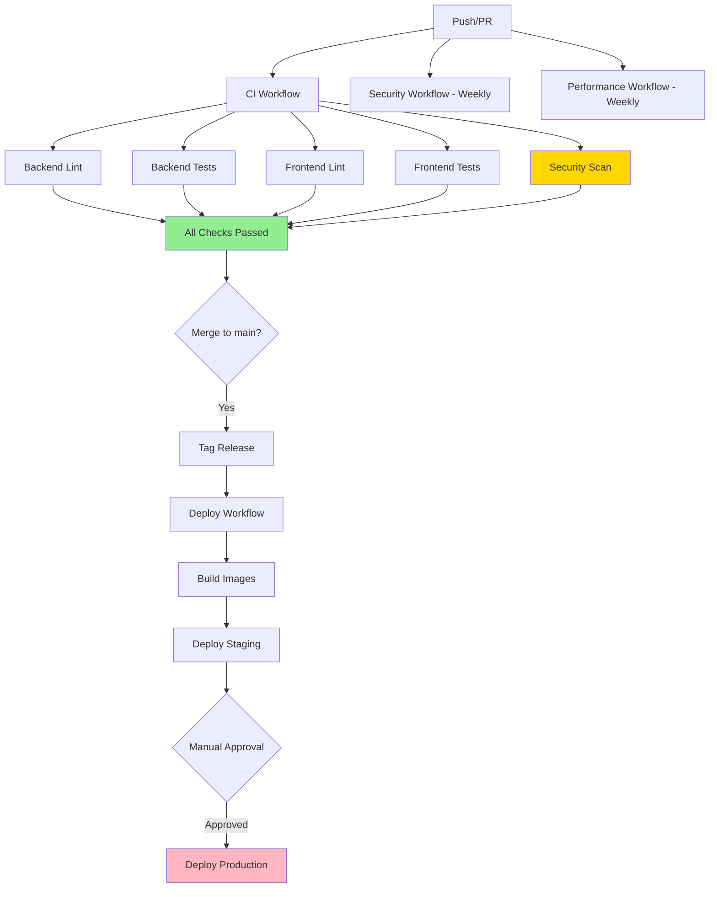

# GitHub Actions Workflow Architecture Guide

Deep dive into the GitHub Actions workflows for BookReader AI, including architecture, optimization strategies, and advanced usage patterns.

## Table of Contents

- [Workflow Architecture](#workflow-architecture)
- [Workflow Dependencies](#workflow-dependencies)
- [Caching Strategy](#caching-strategy)
- [Parallel Execution](#parallel-execution)
- [Environment Variables](#environment-variables)
- [Secrets Management](#secrets-management)
- [Matrix Builds](#matrix-builds)
- [Custom Actions](#custom-actions)
- [Performance Optimization](#performance-optimization)
- [Advanced Patterns](#advanced-patterns)

---

## Workflow Architecture

### Overall Pipeline Flow



### Workflow Breakdown

#### 1. CI Pipeline (`ci.yml`)

**Purpose:** Ensure code quality and test coverage before merge

**Jobs:**
```yaml
Jobs:
  backend-lint:
    - Ruff (linting)
    - Black (formatting)
    - MyPy (type checking)

  backend-tests:
    - pytest with coverage
    - PostgreSQL + Redis services
    - Upload coverage to Codecov

  frontend-lint:
    - ESLint
    - TypeScript type checking

  frontend-tests:
    - Vitest unit tests
    - Build verification
    - Upload build artifacts

  security-scan:
    - Trivy filesystem scan
    - TruffleHog secret detection

  docker-build:
    - Test Docker image builds (PR only)
    - Cache layers for optimization

  all-checks-passed:
    - Final gate
    - Required for PR merge
```

**Execution Time:** 8-12 minutes (parallel)

**Optimization:**
- Jobs run in parallel
- Dependency caching (pip, npm)
- Docker layer caching
- Skip unchanged files

#### 2. Security Workflow (`security.yml`)

**Purpose:** Comprehensive security scanning across all layers

**Jobs:**
```yaml
Jobs:
  dependency-scan-backend:
    - pip-audit
    - safety check

  dependency-scan-frontend:
    - npm audit
    - outdated packages check

  sast-backend:
    - Bandit security scanner

  sast-frontend:
    - ESLint security plugin

  codeql-analysis:
    - GitHub CodeQL (Python + JavaScript)
    - Security and quality queries

  docker-security-backend:
    - Trivy container scanning
    - SARIF upload

  docker-security-frontend:
    - Trivy container scanning

  secrets-detection:
    - TruffleHog (verified secrets)
    - Gitleaks (pattern matching)

  license-compliance:
    - pip-licenses (Python)
    - license-checker (JavaScript)

  security-summary:
    - Aggregate results
    - Fail on critical issues
```

**Execution Time:** 15-20 minutes

**Schedule:** Weekly (Mondays 9 AM UTC) + Push/PR

#### 3. Performance Workflow (`performance.yml`)

**Purpose:** Monitor and enforce performance standards

**Jobs:**
```yaml
Jobs:
  frontend-lighthouse:
    - Lighthouse CI
    - Performance scores
    - Accessibility checks

  frontend-bundle-size:
    - Bundle analysis
    - Size limit enforcement (5MB max)
    - Asset breakdown

  backend-load-test:
    - Locust load testing
    - 10 concurrent users (default)
    - 60-second duration (default)
    - Response time checks

  database-performance:
    - Query performance
    - Connection stats
    - Database size monitoring

  performance-summary:
    - Aggregate metrics
    - Trend analysis
```

**Execution Time:** 10-15 minutes

**Schedule:** Weekly (Sundays 2 AM UTC) + Main branch pushes

#### 4. Type Check Workflow (`type-check.yml`)

**Purpose:** Enforce type safety standards

**Jobs:**
```yaml
Jobs:
  mypy:
    - Full MyPy type checking
    - Generate HTML report
    - PR comment with results

  type-coverage:
    - Calculate type coverage percentage
    - Generate badge
    - Enforce 80% minimum
```

**Execution Time:** 3-5 minutes

#### 5. Deployment Workflow (`deploy.yml`)

**Purpose:** Automated production deployment with safety checks

**Jobs:**
```yaml
Jobs:
  build-and-push:
    - Build Docker images
    - Push to GitHub Container Registry
    - Multi-arch support (optional)

  deploy-staging:
    - SSH to staging server
    - Pull latest images
    - Run migrations
    - Health checks

  deploy-production:
    - Database backup
    - SSH to production server
    - Blue-green deployment
    - Health checks (5 retries)
    - Automatic rollback on failure
```

**Execution Time:** 5-10 minutes

**Triggers:**
- Git tags (v*.*.*)
- Manual workflow dispatch

---

## Workflow Dependencies

### Job Dependencies Graph

```yaml
CI Workflow:
  backend-lint: []
  backend-tests: []
  frontend-lint: []
  frontend-tests: []
  security-scan: []
  docker-build: []  # PR only
  all-checks-passed: [backend-lint, backend-tests, frontend-lint, frontend-tests, security-scan]

Security Workflow:
  dependency-scan-*: []
  sast-*: []
  codeql-analysis: []
  docker-security-*: []
  secrets-detection: []
  license-compliance: []
  security-summary: [ALL_PREVIOUS_JOBS]

Deployment Workflow:
  build-and-push: []
  deploy-staging: [build-and-push]
  deploy-production: [build-and-push]
```

**Parallel Execution:**
- All leaf jobs run in parallel
- Summary jobs wait for all dependencies
- Maximum parallelism for optimal speed

---

## Caching Strategy

### 1. Dependency Caching

**Python (pip):**
```yaml
- uses: actions/setup-python@v5
  with:
    python-version: '3.11'
    cache: 'pip'  # Auto-caches based on requirements.txt
```

**Node.js (npm):**
```yaml
- uses: actions/setup-node@v4
  with:
    node-version: '18'
    cache: 'npm'
    cache-dependency-path: frontend/package-lock.json
```

**Cache Key Format:**
- Python: `${{ runner.os }}-pip-${{ hashFiles('**/requirements.txt') }}`
- Node: `${{ runner.os }}-node-${{ hashFiles('**/package-lock.json') }}`

**Benefits:**
- Reduces dependency install time: 3-5 minutes → 30 seconds
- Automatic invalidation on dependency changes
- Shared across workflow runs

### 2. Docker Layer Caching

```yaml
- name: Build Docker image
  uses: docker/build-push-action@v5
  with:
    cache-from: type=gha
    cache-to: type=gha,mode=max
```

**How it works:**
- GitHub Actions cache stores Docker layers
- Reuses unchanged layers on subsequent builds
- `mode=max` caches all layers (not just final)

**Benefits:**
- Docker build time: 5-10 minutes → 1-2 minutes
- Reduces bandwidth usage
- Faster PR feedback

### 3. Custom Caching

**Example: NLP models (backend):**
```yaml
- name: Cache SpaCy models
  uses: actions/cache@v3
  with:
    path: ~/.cache/spacy
    key: spacy-models-${{ hashFiles('backend/requirements.txt') }}
```

### Cache Management

**Cache Limits:**
- 10 GB per repository
- 7 days retention for unused caches
- Automatic eviction of old caches

**Best Practices:**
- Use specific cache keys
- Include version/hash in key
- Avoid caching generated files
- Clear caches manually if corrupted

---

## Parallel Execution

### Strategy

**Maximum Parallelism:**
```yaml
jobs:
  job-a:
    runs-on: ubuntu-latest
  job-b:
    runs-on: ubuntu-latest
  job-c:
    runs-on: ubuntu-latest
  summary:
    needs: [job-a, job-b, job-c]  # Wait for all
```

**Benefits:**
- 6 jobs in parallel: ~12 min total (not 72 min sequential)
- Faster feedback on PRs
- Better resource utilization

### Matrix Builds (Advanced)

Test multiple versions in parallel:

```yaml
jobs:
  test:
    strategy:
      matrix:
        python-version: ['3.10', '3.11', '3.12']
        os: [ubuntu-latest, macos-latest]
    runs-on: ${{ matrix.os }}
    steps:
      - uses: actions/setup-python@v5
        with:
          python-version: ${{ matrix.python-version }}
```

**Result:** 6 parallel jobs (3 Python × 2 OS)

### Fail-Fast Strategy

```yaml
strategy:
  fail-fast: false  # Continue all jobs even if one fails
  matrix:
    ...
```

**When to use:**
- Testing multiple versions (want all results)
- Security scanning (see all vulnerabilities)

**When NOT to use:**
- PR checks (fail fast to save resources)

---

## Environment Variables

### Global Variables

```yaml
env:
  PYTHON_VERSION: '3.11'
  NODE_VERSION: '18'
  DOCKER_BUILDKIT: 1
```

**Scope:** Available to all jobs in workflow

### Job-Level Variables

```yaml
jobs:
  test:
    env:
      DATABASE_URL: postgresql://localhost/test
      REDIS_URL: redis://localhost:6379
```

**Scope:** Available to all steps in job

### Step-Level Variables

```yaml
- name: Run tests
  env:
    COVERAGE_THRESHOLD: 70
  run: pytest --cov-fail-under=$COVERAGE_THRESHOLD
```

**Scope:** Available only to this step

### Default Environment Variables

GitHub provides:
- `GITHUB_TOKEN` - Authentication token
- `GITHUB_REPOSITORY` - owner/repo
- `GITHUB_SHA` - Commit SHA
- `GITHUB_REF` - Branch/tag reference
- `GITHUB_ACTOR` - User who triggered workflow

**Full list:** https://docs.github.com/en/actions/learn-github-actions/environment-variables

---

## Secrets Management

### Types of Secrets

**1. Repository Secrets:**
- Available to all workflows in repository
- Set in: Settings → Secrets and variables → Actions

**2. Environment Secrets:**
- Available only to specific environment
- Set in: Settings → Environments → [env name] → Secrets

**3. Organization Secrets:**
- Available across multiple repositories
- Set in: Organization Settings → Secrets

### Using Secrets in Workflows

```yaml
steps:
  - name: Deploy
    env:
      SSH_KEY: ${{ secrets.PROD_SSH_KEY }}
      DATABASE_URL: ${{ secrets.DATABASE_URL }}
    run: |
      echo "$SSH_KEY" > ~/.ssh/id_rsa
      chmod 600 ~/.ssh/id_rsa
```

### Security Best Practices

**DO:**
- Use secrets for all sensitive data
- Rotate secrets regularly
- Use environment-specific secrets
- Limit secret scope (environment > repository)

**DON'T:**
- Echo secrets in logs (automatically masked)
- Commit secrets to repository
- Use secrets in PR from forks (not available)
- Share secrets across environments unnecessarily

### Secret Scanning

GitHub automatically scans for leaked secrets:
- Detects known patterns (API keys, tokens)
- Creates alerts
- Can block commits (enterprise)

**Enable:** Settings → Code security and analysis → Secret scanning

---

## Matrix Builds

### Basic Matrix

```yaml
jobs:
  test:
    strategy:
      matrix:
        version: ['3.10', '3.11', '3.12']
    steps:
      - uses: actions/setup-python@v5
        with:
          python-version: ${{ matrix.version }}
```

**Result:** 3 parallel jobs

### Multi-Dimensional Matrix

```yaml
strategy:
  matrix:
    python: ['3.10', '3.11']
    django: ['4.2', '5.0']
```

**Result:** 4 parallel jobs (2 × 2)

### Include/Exclude

```yaml
strategy:
  matrix:
    python: ['3.10', '3.11', '3.12']
    include:
      - python: '3.12'
        experimental: true
    exclude:
      - python: '3.10'  # Skip specific combination
```

### Matrix Variables

```yaml
matrix:
  include:
    - name: 'Linux Python 3.11'
      os: ubuntu-latest
      python: '3.11'
    - name: 'macOS Python 3.12'
      os: macos-latest
      python: '3.12'

steps:
  - name: Test on ${{ matrix.name }}
```

---

## Custom Actions

### Composite Actions

Create reusable actions for common tasks:

```yaml
# .github/actions/setup-python-env/action.yml
name: 'Setup Python Environment'
description: 'Setup Python with caching and dependencies'
inputs:
  python-version:
    description: 'Python version'
    required: true
    default: '3.11'
runs:
  using: 'composite'
  steps:
    - uses: actions/setup-python@v5
      with:
        python-version: ${{ inputs.python-version }}
        cache: 'pip'
    - run: pip install -r requirements.txt
      shell: bash
```

**Usage:**
```yaml
- uses: ./.github/actions/setup-python-env
  with:
    python-version: '3.11'
```

### Reusable Workflows

Share entire workflows:

```yaml
# .github/workflows/test-template.yml
on:
  workflow_call:
    inputs:
      python-version:
        required: true
        type: string

jobs:
  test:
    runs-on: ubuntu-latest
    steps:
      - uses: actions/checkout@v4
      - uses: actions/setup-python@v5
        with:
          python-version: ${{ inputs.python-version }}
```

**Usage:**
```yaml
# .github/workflows/test-python-3.11.yml
on: push
jobs:
  test:
    uses: ./.github/workflows/test-template.yml
    with:
      python-version: '3.11'
```

---

## Performance Optimization

### 1. Reduce Workflow Duration

**Current Optimization:**
- Parallel job execution: ✅
- Dependency caching: ✅
- Docker layer caching: ✅
- Skip unchanged files: ⚠️ (can improve)

**Further Optimization:**

```yaml
on:
  push:
    paths:
      - 'backend/**'
      - '!backend/docs/**'
```

**Skip CI for docs:**
```bash
git commit -m "docs: update README [skip ci]"
```

### 2. Optimize Docker Builds

**Multi-stage builds:**
```dockerfile
# Stage 1: Build
FROM python:3.11 AS builder
WORKDIR /app
COPY requirements.txt .
RUN pip install --user -r requirements.txt

# Stage 2: Runtime
FROM python:3.11-slim
COPY --from=builder /root/.local /root/.local
COPY . .
CMD ["python", "app.py"]
```

**Benefits:**
- Smaller final image
- Faster builds with caching
- Reduced deployment time

### 3. Selective Job Execution

```yaml
jobs:
  backend-tests:
    if: contains(github.event.head_commit.message, 'backend')
```

### 4. Concurrency Control

```yaml
concurrency:
  group: ${{ github.workflow }}-${{ github.ref }}
  cancel-in-progress: true
```

**Benefits:**
- Cancel outdated workflow runs
- Save compute resources
- Faster feedback on latest push

---

## Advanced Patterns

### 1. Conditional Job Execution

**Run job only on main branch:**
```yaml
jobs:
  deploy:
    if: github.ref == 'refs/heads/main'
```

**Run job only for specific file changes:**
```yaml
jobs:
  docs:
    if: contains(github.event.head_commit.modified, 'docs/')
```

### 2. Dynamic Matrix

```yaml
jobs:
  setup:
    runs-on: ubuntu-latest
    outputs:
      matrix: ${{ steps.set-matrix.outputs.matrix }}
    steps:
      - id: set-matrix
        run: |
          MATRIX=$(cat matrix.json)
          echo "matrix=$MATRIX" >> $GITHUB_OUTPUT

  test:
    needs: setup
    strategy:
      matrix: ${{ fromJson(needs.setup.outputs.matrix) }}
```

### 3. Artifact Passing Between Jobs

```yaml
jobs:
  build:
    steps:
      - run: npm run build
      - uses: actions/upload-artifact@v4
        with:
          name: dist
          path: dist/

  deploy:
    needs: build
    steps:
      - uses: actions/download-artifact@v4
        with:
          name: dist
          path: dist/
```

### 4. Manual Approval Gates

```yaml
jobs:
  deploy:
    environment:
      name: production
      url: https://bookreader.example.com
    steps:
      - run: ./deploy.sh
```

**Requires:** Environment protection rules with required reviewers

### 5. Retry Failed Steps

```yaml
- name: Flaky test
  uses: nick-invision/retry@v2
  with:
    timeout_minutes: 10
    max_attempts: 3
    command: npm test
```

### 6. Job Outputs

```yaml
jobs:
  build:
    outputs:
      version: ${{ steps.meta.outputs.version }}
    steps:
      - id: meta
        run: echo "version=1.0.0" >> $GITHUB_OUTPUT

  deploy:
    needs: build
    steps:
      - run: echo "Deploying version ${{ needs.build.outputs.version }}"
```

---

## Monitoring & Debugging

### Workflow Run Logs

**Access logs:**
1. Go to **Actions** tab
2. Select workflow run
3. Click on job name
4. Expand step to see detailed logs

**Download logs:**
```bash
gh run view RUN_ID --log > workflow-logs.txt
```

### Debug Logging

**Enable:**
```yaml
env:
  ACTIONS_RUNNER_DEBUG: true
  ACTIONS_STEP_DEBUG: true
```

**Result:** Extremely verbose logs with internals

### Status Checks

**Monitor via API:**
```bash
curl -H "Authorization: token $GITHUB_TOKEN" \
  https://api.github.com/repos/OWNER/REPO/commits/SHA/check-runs
```

**View in UI:**
- PR → Checks tab
- Commit → Status checks

---

## Cost Optimization

### GitHub Actions Pricing

**Free Tier (Public repos):**
- Unlimited minutes
- Unlimited storage

**Free Tier (Private repos):**
- 2,000 minutes/month
- 500 MB storage

**Usage Monitoring:**
- Settings → Billing → Actions

### Optimization Tips

1. **Use caching** - Reduces billable minutes
2. **Cancel redundant runs** - Concurrency control
3. **Optimize Docker builds** - Multi-stage, caching
4. **Use self-hosted runners** - For heavy workloads (advanced)
5. **Skip CI when not needed** - `[skip ci]` commits

---

## Additional Resources

- [GitHub Actions Documentation](https://docs.github.com/en/actions)
- [Workflow Syntax Reference](https://docs.github.com/en/actions/using-workflows/workflow-syntax-for-github-actions)
- [Events that trigger workflows](https://docs.github.com/en/actions/using-workflows/events-that-trigger-workflows)
- [GitHub Actions Marketplace](https://github.com/marketplace?type=actions)

---

**Last Updated:** 2025-10-29
**Version:** 1.0.0
**Maintainer:** DevOps Team
