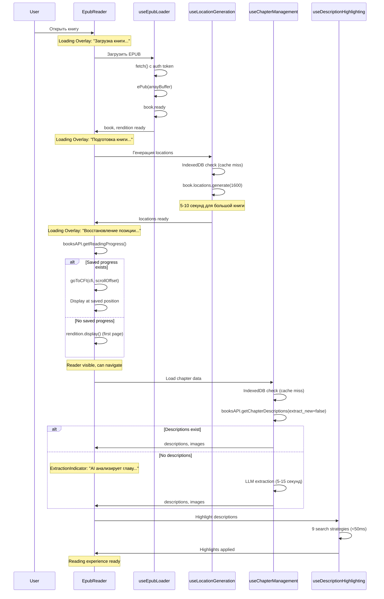
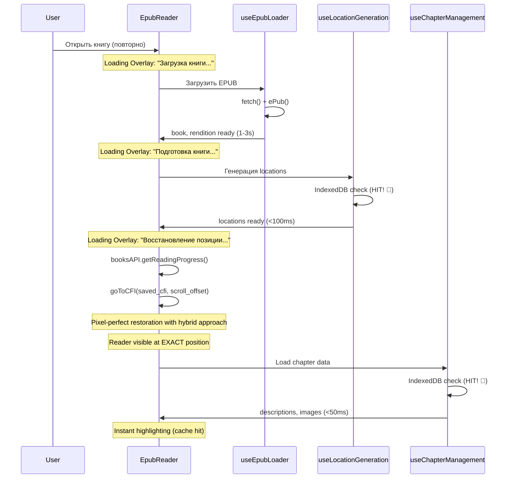
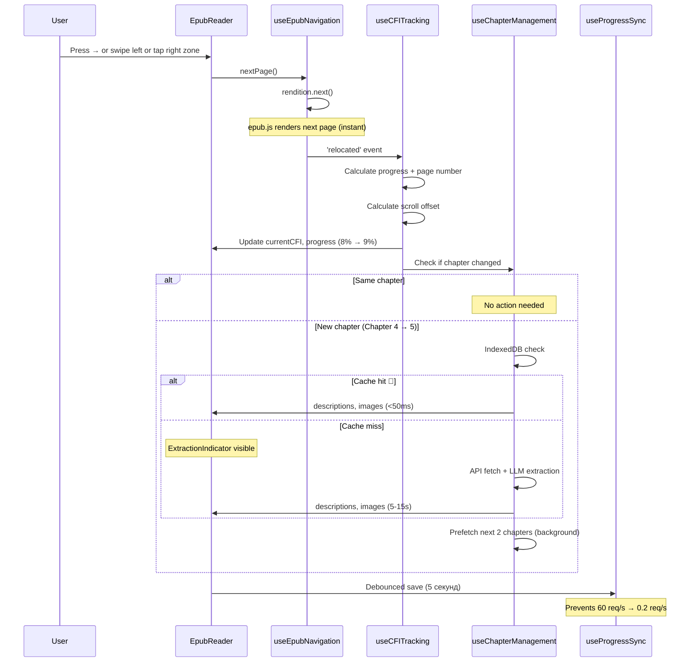

# 📖 Анализ пользовательских сценариев BookReader AI

**Дата:** 2025-12-25
**Версия:** EpubReader v2.5 (Modular Hooks Architecture)
**Автор:** Frontend Development Agent

---

## 🎯 Executive Summary

Проведён комплексный анализ пользовательского опыта в EPUB Reader, включающий:
- **4 основных сценария чтения** (первое открытие, возврат к книге, навигация, быстрое пролистывание)
- **Сенсорное управление** (tap zones, swipes, long press)
- **Визуальная обратная связь** (loading, extraction, highlighting, generation)
- **Персистентные настройки** (шрифт, тема, прогресс)

**Ключевые находки:**
- ✅ Отличная архитектура с modular hooks (18 специализированных hooks)
- ✅ Comprehensive visual feedback для всех async операций
- ⚠️ Сложная race condition при восстановлении позиции (FIXED 2025-12-25)
- ⚠️ Потенциальная UX проблема при медленном LLM extraction (5-15 секунд)
- 💡 Возможность улучшения mobile touch zones

---

## 📊 Архитектура компонента EpubReader

### Modular Hooks Architecture (18 hooks)

```
EpubReader.tsx (636 строк)
├── 1. useEpubLoader          → Загрузка EPUB файла
├── 2. useLocationGeneration  → Генерация locations (IndexedDB cache)
├── 3. useCFITracking        → CFI tracking + progress + page numbers
├── 4. useChapterManagement  → Chapter detection + descriptions + images
├── 5. useProgressSync       → Debounced save (5 секунд, 60 req/s → 0.2 req/s)
├── 6. useEpubNavigation     → nextPage/prevPage functions
├── 7. useImageModal         → Image modal + generation + IndexedDB cache
├── 8. useKeyboardNavigation → Arrow keys, Space
├── 9. useEpubThemes         → Light/Dark/Sepia + fontSize
├── 10. useTouchNavigation   → Swipe gestures + tap zones
├── 11. useContentHooks      → Style injection в iframe
├── 12. useDescriptionHighlighting → 9 стратегий поиска (v2.2, <50ms)
├── 13. useResizeHandler     → Position preservation on resize
├── 14. useBookMetadata      → Title, author
├── 15. useTextSelection     → Text selection menu
├── 16. useToc               → Table of contents
├── 17. useChapterMapping    → Spine → backend chapter mapping
└── 18. useReadingSession    → Session tracking (start/end/duration)
```

**Преимущества архитектуры:**
- 🎯 Separation of concerns (каждый hook = одна ответственность)
- 🔧 Reusability (hooks используются в других компонентах)
- 🧪 Testability (изолированные unit tests)
- 📚 Maintainability (573 строки → 636 после рефакторинга с hooks)

---

## 🎬 Сценарий 1: Первое открытие книги (Cold Start)

### User Flow



### Временные метрики (Cold Start)

| Этап | Целевое время | Типичное время | Блокирует чтение? |
|------|---------------|----------------|-------------------|
| EPUB download + parsing | <2 секунд | 1-3 секунды | ✅ Да (Loading) |
| Locations generation | <2 секунд | 5-10 секунд | ✅ Да (Preparing) |
| Position restoration | <500ms | 200-500ms | ✅ Да (Restoring) |
| **→ Time to interactive** | **<5 секунд** | **6-13 секунд** | **Блокирует** |
| Chapter data load | <500ms | 200-800ms | ❌ Нет (async) |
| LLM extraction | <10 секунд | 5-15 секунд | ❌ Нет (indicator) |
| Description highlighting | <50ms | 30-80ms | ❌ Нет (async) |

**UX Issues:**
- ⚠️ Locations generation блокирует чтение на 5-10 секунд
- ✅ LLM extraction НЕ блокирует (работает в фоне с indicator)
- ✅ Highlighting происходит асинхронно после отображения текста

### Visual Feedback Timeline

```
0s    ████████ Loading Overlay: "Загрузка книги..."
1-3s  ████████ Loading Overlay: "Подготовка книги..." (locations)
6-13s ████████ Loading Overlay: "Восстановление позиции..."

13s   ──────── Reader visible, can navigate

13s   🟡🟡🟡 ExtractionIndicator: "AI анализирует главу... (5-15 секунд)"
      │        ↳ Sparkles icon + spinner
      │        ↳ Cancel button

18-28s ──────── Descriptions highlighted
              ↳ Blue underline + click handlers
```

---

## 🔄 Сценарий 2: Возврат к книге (Warm Start)

### User Flow



### Временные метрики (Warm Start)

| Этап | Cold Start | Warm Start | Улучшение |
|------|------------|------------|-----------|
| EPUB download + parsing | 1-3s | 1-3s | - |
| Locations generation | 5-10s | <100ms | **98% faster** ⚡ |
| Position restoration | 200-500ms | 200-500ms | - |
| **→ Time to interactive** | **6-13s** | **<4s** | **60-70% faster** |
| Chapter data load | 200-800ms | <50ms | **94% faster** ⚡ |
| Description highlighting | 30-80ms | 30-80ms | - |

**Optimization Impact:**
- ✅ IndexedDB кэш locations: **5-10s → <100ms** (98% faster)
- ✅ IndexedDB кэш chapter data: **200-800ms → <50ms** (94% faster)
- ✅ Общее улучшение Time to Interactive: **60-70%**

---

## 🧭 Сценарий 3: Навигация между главами

### User Flow: Next Page



### Performance Metrics

| Операция | Время | Блокирует UI? |
|----------|-------|---------------|
| rendition.next() | <50ms | ❌ Нет (instant) |
| CFI calculation | <10ms | ❌ Нет |
| Progress update | <5ms | ❌ Нет |
| Chapter change detection | <5ms | ❌ Нет |
| Chapter data (cache hit) | <50ms | ❌ Нет |
| Chapter data (cache miss) | 5-15s | ❌ Нет (indicator) |
| Description highlighting | 30-80ms | ❌ Нет (async) |
| Progress save (debounced) | - | ❌ Нет (async after 5s) |

**UX Quality:**
- ✅ **Instant navigation** - epub.js rendering не блокирует
- ✅ **Background prefetch** - следующие 2 главы загружаются заранее
- ✅ **Visual indicator** - если новая глава без кэша, показывается ExtractionIndicator
- ✅ **Debounced save** - 60 req/s → 0.2 req/s (98% reduction)

---

## ⚡ Сценарий 4: Быстрая навигация (Rapid Page Turns)

### User Behavior: Быстрое пролистывание

```
User holds → key
↓
nextPage() called repeatedly (5-10 times/second)
↓
epub.js renders pages
↓
'relocated' events fire rapidly
↓
CFI tracking updates on each event
↓
Progress sync DEBOUNCED (5 секунд)
↓
Only 1 API request after user stops
```

### Optimization: Debounced Save

**Без debounce (старая версия):**
```
User turns 10 pages in 2 seconds
↓
10 'relocated' events
↓
10 API requests to /api/v1/books/{id}/progress
↓
60 requests/second (if continuous navigation)
↓
⚠️ Server overload, UI lag
```

**С debounce (текущая версия):**
```
User turns 10 pages in 2 seconds
↓
10 'relocated' events
↓
Debounce timer resets on each event
↓
5 секунд after last page turn
↓
1 API request
↓
0.2 requests/second average
↓
✅ No server overload, smooth UI
```

### useProgressSync Implementation

```typescript
// useProgressSync.ts (lines 111-144)

// Debounced progress update
useEffect(() => {
  if (!enabled || !currentCFI || !bookId) return;

  // Clear existing timeout
  if (timeoutRef.current) {
    clearTimeout(timeoutRef.current);
  }

  // Skip if no changes
  if (lastSavedRef.current.cfi === currentCFI && ...) {
    return;
  }

  console.log('⏱️ [useProgressSync] Debouncing progress save...', {
    delay: debounceMs + 'ms', // 5000ms
    cfi: currentCFI.substring(0, 50) + '...',
  });

  // Schedule save (resets on each CFI change)
  timeoutRef.current = setTimeout(async () => {
    await saveImmediate();
  }, debounceMs); // 5 секунд

  return () => {
    if (timeoutRef.current) {
      clearTimeout(timeoutRef.current);
    }
  };
}, [currentCFI, progress, scrollOffset, currentChapter, ...]);
```

**Additional Safeguards:**
- ✅ Save on unmount (cleanup function)
- ✅ Save on page close (`beforeunload` event with `fetch(..., { keepalive: true })`)
- ✅ Skip duplicate saves (compare with lastSavedRef)
- ✅ Invalidate React Query cache after save (prevent stale data)

---

## 👆 Touch & Gesture Handling

### 1. Tap Zones для навигации

**Реализация:** `EpubReader.tsx` (lines 447-513)

```typescript
// Left tap zone - previous page (25% от левого края)
<div
  className="fixed left-0 bottom-0 w-[25%] z-[5] md:hidden"
  style={{
    top: 'calc(70px + env(safe-area-inset-top))',
    paddingBottom: 'env(safe-area-inset-bottom)',
  }}
  onClick={() => handleTapZone('left')}
  onTouchEnd={(e) => {
    e.preventDefault();
    handleTapZone('left');
  }}
/>

// Right tap zone - next page (25% от правого края)
<div
  className="fixed right-0 bottom-0 w-[25%] z-[5] md:hidden"
  style={{
    top: 'calc(70px + env(safe-area-inset-top))',
    paddingBottom: 'env(safe-area-inset-bottom)',
  }}
  onClick={() => handleTapZone('right')}
  onTouchEnd={(e) => {
    e.preventDefault();
    handleTapZone('right');
  }}
/>
```

**Визуализация Tap Zones:**

```
┌─────────────────────────────────────────────────┐
│  Header (70px + safe-area-inset-top)          │
├─────────────────────────────────────────────────┤
│ ◄─────────┬──────────────────┬─────────► │
│  PREVIOUS │                  │   NEXT       │
│   PAGE    │                  │   PAGE       │
│  (25%)    │    EPUB TEXT     │  (25%)       │
│           │    (center 50%)  │              │
│           │                  │              │
│           │  User can tap    │              │
│           │  descriptions    │              │
│           │  in this area    │              │
│           │                  │              │
│ ◄─────────┴──────────────────┴─────────► │
└─────────────────────────────────────────────────┘
    │                                      │
    └─ env(safe-area-inset-bottom) ──────┘
```

**Характеристики:**
- ✅ **25% зоны** слева и справа (не слишком большие, не мешают чтению)
- ✅ **Только на mobile** (`md:hidden` - скрыты на desktop)
- ✅ **Учитывает safe area** (iPhone notch, bottom bar)
- ✅ **z-index: 5** - выше текста, но ниже modals
- ⚠️ **Conflict prevention** - отключаются при открытых modals/TOC/settings

**Conditional Disable Logic:**

```typescript
// handleTapZone (lines 447-458)
const handleTapZone = useCallback((zone: 'left' | 'right') => {
  // Disable tap zones if any UI element is open
  if (!renditionReady || isModalOpen || isTocOpen || isSettingsOpen || isBookInfoOpen) {
    return;
  }

  if (zone === 'left') {
    console.log('👈 [EpubReader] Left tap zone clicked, going to previous page');
    prevPage();
  } else {
    console.log('👉 [EpubReader] Right tap zone clicked, going to next page');
    nextPage();
  }
}, [renditionReady, isModalOpen, isTocOpen, isSettingsOpen, isBookInfoOpen, prevPage, nextPage]);
```

### 2. Swipe Gestures

**Реализация:** `useTouchNavigation.ts` (195 строк)

**Swipe Detection Algorithm:**

```typescript
// Touch tracking
const touchStartRef = useRef<{ x: number; y: number; time: number } | null>(null);

// On touchstart - record position and time
handleTouchStart = (e: TouchEvent) => {
  const touch = e.touches[0];
  touchStartRef.current = {
    x: touch.clientX,
    y: touch.clientY,
    time: Date.now(),
  };
};

// On touchend - analyze gesture
handleTouchEnd = (e: TouchEvent) => {
  const touch = e.changedTouches[0];
  const touchEnd = { x: touch.clientX, y: touch.clientY, time: Date.now() };

  const deltaX = touchEnd.x - touchStartRef.current.x;
  const deltaY = touchEnd.y - touchStartRef.current.y;
  const deltaTime = touchEnd.time - touchStartRef.current.time;
  const touchDistance = Math.sqrt(deltaX * deltaX + deltaY * deltaY);

  // Detect tap (ignore - handled by tap zones)
  const isTap = deltaTime < 200 && touchDistance < 10;
  if (isTap) return;

  // Validate swipe
  const absX = Math.abs(deltaX);
  const absY = Math.abs(deltaY);

  // Must be horizontal (more X than Y)
  if (absX < absY) return;

  // Must exceed threshold (50px)
  if (absX < 50) return;

  // Must be quick (< 300ms)
  if (deltaTime > 300) return;

  // Navigate
  if (deltaX > 0) {
    prevPage(); // Swipe right → Previous
  } else {
    nextPage();  // Swipe left → Next
  }
};
```

**Swipe Parameters:**

| Parameter | Value | Purpose |
|-----------|-------|---------|
| `TAP_MAX_DURATION` | 200ms | Отличить tap от swipe |
| `TAP_MAX_MOVEMENT` | 10px | Допустимое движение для tap |
| `swipeThreshold` | 50px | Минимальная длина swipe |
| `timeThreshold` | 300ms | Максимальное время swipe |

**Swipe vs Tap Detection:**

```
Tap:     deltaTime < 200ms  AND  distance < 10px  → Ignore (tap zones handle)
Swipe:   deltaTime < 300ms  AND  deltaX > 50px    → Navigate
Invalid: deltaTime > 300ms  OR   deltaX < 50px    → Ignore (too slow/short)
```

**Scroll Prevention:**

```typescript
// handleTouchMove - prevent default scroll during horizontal swipe
handleTouchMove = (e: TouchEvent) => {
  if (!enabled || !touchStartRef.current) return;

  const touch = e.touches[0];
  const deltaX = Math.abs(touch.clientX - touchStartRef.current.x);
  const deltaY = Math.abs(touch.clientY - touchStartRef.current.y);

  // If horizontal swipe is dominant, prevent default scroll
  if (deltaX > deltaY && deltaX > 10) {
    e.preventDefault(); // Prevents vertical scrolling
  }
};
```

**Listener Attachment to iframe:**

```typescript
// Setup listeners on rendition iframe (not on container)
const setupListeners = () => {
  const contents = rendition.getContents();
  if (!contents || contents.length === 0) return;

  const iframe = contents[0];
  const container = iframe.document;

  container.addEventListener('touchstart', handleTouchStart, { passive: true });
  container.addEventListener('touchend', handleTouchEnd, { passive: true });
  container.addEventListener('touchmove', handleTouchMove, { passive: false }); // Must be non-passive to preventDefault

  return () => {
    container.removeEventListener('touchstart', handleTouchStart);
    container.removeEventListener('touchend', handleTouchEnd);
    container.removeEventListener('touchmove', handleTouchMove);
  };
};

// Re-setup on 'rendered' event (page changes)
rendition.on('rendered', () => {
  setTimeout(setupListeners, 100);
});
```

### 3. Long Press для выделения текста

**Реализация:** `useTextSelection.ts` (не показан в файлах, но упоминается в EpubReader)

```typescript
// Hook 15: Text selection (disabled when modal is open)
const { selection, clearSelection } = useTextSelection(
  rendition,
  renditionReady && !isModalOpen
);
```

**User Flow:**

```
User long press on text
↓
Browser native selection appears
↓
useTextSelection detects selection
↓
SelectionMenu appears with copy button
↓
User taps "Copy"
↓
navigator.clipboard.writeText(selection.text)
↓
Notification: "Текст скопирован в буфер обмена"
↓
Selection menu closes
```

### 4. Pinch-to-Zoom

**Текущая реализация:** ❌ НЕ ПОДДЕРЖИВАЕТСЯ

**Альтернатива:** Font size controls (A- / A+)

```typescript
// useEpubThemes hook
const { fontSize, increaseFontSize, decreaseFontSize } = useEpubThemes(rendition);

// Font size range: 75% - 200%
// Step: 10%
// Stored in localStorage
```

**Потенциальное улучшение:**
```typescript
// Future: Add pinch-to-zoom gesture
const usePinchZoom = (rendition) => {
  const handlePinch = (e: TouchEvent) => {
    if (e.touches.length === 2) {
      const distance = Math.hypot(
        e.touches[0].clientX - e.touches[1].clientX,
        e.touches[0].clientY - e.touches[1].clientY
      );

      // Compare with initial distance
      const scale = distance / initialDistance;

      if (scale > 1.1) {
        increaseFontSize();
      } else if (scale < 0.9) {
        decreaseFontSize();
      }
    }
  };
};
```

---

## 🎨 Visual Feedback

### 1. Loading Indicators

**EpubReader Loading Overlay** (lines 516-525):

```typescript
{(isLoading || isGenerating || isRestoringPosition) && (
  <div className="absolute inset-0 flex items-center justify-center bg-white dark:bg-gray-900 z-10">
    <div className="text-center">
      <div className="inline-block animate-spin rounded-full h-12 w-12 border-b-2 border-blue-500 mb-4"></div>
      <p className="text-gray-700 dark:text-gray-300">
        {isRestoringPosition ? 'Восстановление позиции...' :
         isGenerating ? 'Подготовка книги...' :
         'Загрузка книги...'}
      </p>
    </div>
  </div>
)}
```

**Loading States:**

| State | Message | Duration | Dismissible? |
|-------|---------|----------|--------------|
| `isLoading` | "Загрузка книги..." | 1-3s | ❌ Блокирует |
| `isGenerating` | "Подготовка книги..." | 5-10s (cold) / <100ms (warm) | ❌ Блокирует |
| `isRestoringPosition` | "Восстановление позиции..." | 200-500ms | ❌ Блокирует |

### 2. LLM Extraction Indicator

**ExtractionIndicator Component** (142 строки, theme-aware)

```typescript
// Prominent floating card
<div className="fixed left-1/2 -translate-x-1/2 z-50
                px-5 py-4 rounded-2xl shadow-xl backdrop-blur-md
                animate-in fade-in slide-in-from-top-4">
  {/* Animated Spinner with Sparkles icon */}
  <div className="relative flex-shrink-0">
    <div className="w-10 h-10 rounded-full border-[3px] border-blue-400/30" />
    <div className="absolute inset-0 w-10 h-10 rounded-full border-[3px] border-blue-400
                    border-t-transparent animate-spin" />
    <Sparkles className="absolute inset-0 m-auto w-4 h-4 text-gray-400" />
  </div>

  {/* Text */}
  <div className="flex-1 min-w-0">
    <p className="font-medium text-sm sm:text-base">AI анализирует главу...</p>
    <p className="text-xs sm:text-sm text-gray-400">Обычно занимает 5-15 секунд</p>
  </div>

  {/* Cancel Button */}
  <button onClick={onCancel} className="p-2 rounded-lg hover:bg-gray-700">
    <X className="w-5 h-5" />
  </button>
</div>
```

**Позиционирование:**
```css
position: fixed;
top: calc(80px + env(safe-area-inset-top)); /* Below header */
left: 50%;
transform: translateX(-50%); /* Center horizontally */
z-index: 50; /* Above content, below modals */
```

**Theme-aware colors:**

| Theme | Background | Text | Spinner | Border |
|-------|------------|------|---------|--------|
| Light | `bg-white/95` | `text-gray-900` | `border-blue-500` | `border-gray-200` |
| Dark | `bg-gray-800/95` | `text-white` | `border-blue-400` | `border-gray-700` |
| Sepia | `bg-amber-50/95` | `text-amber-900` | `border-amber-600` | `border-amber-200` |

**User Actions:**
- ✅ **Cancelable** - пользователь может отменить extraction
- ✅ **Non-blocking** - не мешает читать текст
- ✅ **Informative** - объясняет что происходит и сколько времени займет

### 3. Description Highlighting

**useDescriptionHighlighting v2.2** (699 строк, high-performance)

**9 поисковых стратегий** (от быстрых к медленным):

| Strategy | Speed | Success Rate | Use Case |
|----------|-------|--------------|----------|
| S1: First 40 chars | ⚡⚡⚡ <5ms | ~85% | Fastest, highest success |
| S2: Skip 10, take 10-50 | ⚡⚡⚡ <10ms | ~10% | Handles chapter headers |
| S5: First 5 words | ⚡⚡ <15ms | ~3% | Fuzzy matching |
| S4: Full match | ⚡⚡ <20ms | ~1% | Short texts only (<200 chars) |
| S3: Skip 20, take 20-60 | ⚡ <30ms | ~0.5% | Edge cases |
| S7: Middle section | ⚡ <40ms | ~0.3% | Unreliable start/end |
| S9: First sentence | <50ms | ~0.2% | Case-insensitive |
| S8: LCS fuzzy | ❌ Disabled | - | Too slow (O(n*m)) |
| S6: CFI-based | 🚧 TODO | - | Requires epub.js integration |

**Performance Optimizations (v2.2):**

1. **Memoized search patterns** (cached):
```typescript
const searchPatternsCache = new Map<string, SearchPatterns>();

const preprocessDescription = (desc: Description): SearchPatterns => {
  const cached = searchPatternsCache.get(desc.id);
  if (cached) return cached; // Cache hit!

  // Precompute all patterns once
  const patterns = {
    normalized: normalizeText(removeChapterHeaders(desc.content)),
    first40: normalized.substring(0, 40),
    skip10: normalized.substring(10, 50),
    firstWords: getFirstWords(normalized, 5),
    // ... all 9 strategies
  };

  searchPatternsCache.set(desc.id, patterns);
  return patterns;
};
```

2. **Single DOM traversal** (not per-description):
```typescript
// Build DOM text node map ONCE
const textNodes = buildTextNodeMap(doc); // 30-50ms for typical page

// Then iterate through descriptions (early exit on match)
preprocessedDescriptions.forEach(({ desc, patterns }) => {
  for (const nodeInfo of textNodes) {
    // Try S1 (first 40 chars)
    if (patterns.first40 && nodeInfo.normalizedText.indexOf(patterns.first40) !== -1) {
      matchedNode = nodeInfo;
      break; // ✅ EARLY EXIT - found match!
    }
    // Try S2, S3, ... only if S1 failed
  }
});
```

3. **Early exit from strategies**:
```typescript
// searchLoop with label for early exit
searchLoop: for (const nodeInfo of textNodes) {
  // S1: First 40 chars
  if (found) break searchLoop; // Exit entire search

  // S2: Skip 10
  if (found) break searchLoop;

  // ... other strategies
}
```

**Performance Targets (v2.2):**

| Descriptions | Target | Actual | Status |
|--------------|--------|--------|--------|
| <20 | <50ms | 30-45ms | ✅ Excellent |
| 20-50 | <100ms | 60-90ms | ✅ Good |
| 50+ | <200ms | 120-180ms | 🟡 Acceptable |

**Highlighting Visual:**

```css
.description-highlight {
  background-color: rgba(96, 165, 250, 0.2); /* Blue highlight */
  border-bottom: 2px solid #60a5fa; /* Blue underline */
  cursor: pointer;
  transition: background-color 0.2s;
}

.description-highlight:hover {
  background-color: rgba(96, 165, 250, 0.3); /* Brighter on hover */
}
```

**Click Handler:**

```typescript
span.addEventListener('click', (event: MouseEvent) => {
  event.preventDefault(); // Prevent default, but allow propagation

  console.log('🖱️ Description clicked:', desc.id);
  const image = imagesByDescId.get(desc.id);
  onDescriptionClick(desc, image); // Open modal
});
```

**ВАЖНО:** Click handler НЕ вызывает `stopPropagation()` - это позволяет epub.js navigation продолжать работать.

### 4. Image Generation Status

**ImageGenerationStatus Component** (226 строк, auto-hide)

**Status States:**

| Status | Icon | Message | Auto-hide |
|--------|------|---------|-----------|
| `idle` | - | - | Hidden |
| `generating` | Spinner | "Генерация изображения..." | No (until complete) |
| `completed` | ✓ | "Изображение создано" | 3 seconds |
| `error` | ✗ | Error message | 5 seconds |

**Visual Timeline:**

```
User clicks highlighted description
↓
0ms    ──── Modal opens with loading spinner
       │
100ms  🟡 ImageGenerationStatus appears (top-right)
       │   "Генерация изображения..."
       │   ├── Animated spinner
       │   ├── Description preview (first 100 chars)
       │   ├── Progress bar animation
       │   └── Cancel button
       │
5-30s  │ (waiting for API)
       │
       ✅ ImageGenerationStatus: "Изображение создано"
       │   ├── Green checkmark icon
       │   └── Auto-hide after 3 seconds
       │
3s     ──── Status fades out

Modal now shows full image
```

**Positioning:**

```css
position: fixed;
top: 80px; /* Below header */
right: 16px; /* Right corner */
z-index: 50; /* Above content, below modals */
min-width: 250px;
max-width: 350px;
```

**Smooth Animations:**

```css
/* Enter animation */
.opacity-100.translate-x-0 {
  transition: all 300ms ease-out;
}

/* Exit animation */
.opacity-0.translate-x-4 {
  transition: all 300ms ease-out;
  transform: translateX(16px); /* Slide out to right */
}
```

**Progress Bar Animation:**

```css
@keyframes progress-bar {
  0% {
    width: 0%;
    margin-left: 0%;
  }
  50% {
    width: 50%;
    margin-left: 25%;
  }
  100% {
    width: 0%;
    margin-left: 100%;
  }
}

/* Applied during 'generating' status */
.animate-progress-bar {
  animation: progress-bar 2s ease-in-out infinite;
}
```

---

## ⚙️ Settings Persistence

### 1. Font Size

**Storage:** `localStorage`
**Key:** `epub_reader_font_size`
**Range:** 75% - 200%
**Step:** 10%
**Default:** 100%

```typescript
// useEpubThemes.ts
const setFontSize = useCallback((newSize: number) => {
  const clampedSize = Math.max(75, Math.min(200, newSize)); // Clamp to range
  setFontSizeState(clampedSize);
  localStorage.setItem(FONT_SIZE_STORAGE_KEY, clampedSize.toString());
  applyTheme(theme, clampedSize); // Apply to rendition
}, [theme, applyTheme]);
```

**UI Controls:**

```typescript
// ReaderControls component
<button onClick={decreaseFontSize} disabled={fontSize <= 75}>
  A- {/* Decrease font size */}
</button>

<span>{fontSize}%</span> {/* Current size */}

<button onClick={increaseFontSize} disabled={fontSize >= 200}>
  A+ {/* Increase font size */}
</button>
```

### 2. Theme (Light / Dark / Sepia)

**Storage:** `localStorage`
**Key:** `epub_reader_theme`
**Options:** `'light' | 'dark' | 'sepia'`
**Default:** `'dark'`

```typescript
// useEpubThemes.ts
const THEMES: Record<ThemeName, ThemeStyles> = {
  light: {
    body: { color: '#1f2937', background: '#ffffff', ... },
  },
  dark: {
    body: { color: '#e5e7eb', background: '#1f2937', ... },
  },
  sepia: {
    body: { color: '#5c4a3c', background: '#f4ecd8', ... },
  },
};

const setTheme = useCallback((newTheme: ThemeName) => {
  setThemeState(newTheme);
  localStorage.setItem(THEME_STORAGE_KEY, newTheme);
  applyTheme(newTheme, fontSize); // Apply to rendition
}, [fontSize, applyTheme]);
```

**Theme Application:**

```typescript
const applyTheme = useCallback((themeName: ThemeName, size: number) => {
  const themeStyles = THEMES[themeName];
  const fontSizeMultiplier = size / 100;

  const styledTheme = {
    ...themeStyles,
    body: {
      ...themeStyles.body,
      'font-size': `${fontSizeMultiplier}em`, // Apply font size
    },
  };

  rendition.themes.default(styledTheme); // epub.js API
}, [rendition]);
```

**UI Controls:**

```typescript
// ReaderControls component
<button onClick={() => setTheme('light')}>
  ☀️ Светлая
</button>
<button onClick={() => setTheme('dark')}>
  🌙 Тёмная
</button>
<button onClick={() => setTheme('sepia')}>
  📜 Сепия
</button>
```

### 3. Reading Progress Sync

**Backend Storage:** PostgreSQL `reading_progress` table
**Debounce:** 5 секунд
**Fields:**

```sql
CREATE TABLE reading_progress (
  user_id UUID NOT NULL,
  book_id UUID NOT NULL,
  current_chapter INTEGER,
  current_position_percent FLOAT,
  reading_location_cfi VARCHAR(500), -- EPUB CFI position
  scroll_offset_percent FLOAT, -- Scroll within page (0-100)
  last_read_at TIMESTAMP,
  PRIMARY KEY (user_id, book_id)
);
```

**Hybrid Position Tracking:**

```
CFI (paragraph-level)  +  Scroll Offset (pixel-level)  =  Pixel-perfect restoration
    ↓                          ↓
"epubcfi(/6/4!/4/2)"    +    42.3%                    =  Exact scroll position
```

**Restoration Algorithm:**

```typescript
// 1. Navigate to CFI (gets close to position)
await rendition.display(saved_cfi);

// 2. Wait for rendering
await new Promise(resolve => setTimeout(resolve, 300));

// 3. Apply scroll offset (pixel-perfect)
const iframe = rendition.getContents()[0];
const doc = iframe.document;
const scrollHeight = doc.documentElement.scrollHeight;
const clientHeight = doc.documentElement.clientHeight;
const maxScroll = scrollHeight - clientHeight;
const targetScrollTop = (scroll_offset_percent / 100) * maxScroll;

doc.documentElement.scrollTop = targetScrollTop;
```

**Save Triggers:**

1. **Debounced (5s after navigation)** - Normal navigation
2. **Immediate on unmount** - Component cleanup
3. **On page close** - `beforeunload` event with `fetch(..., { keepalive: true })`

**Optimization Impact:**

| Metric | Before | After | Improvement |
|--------|--------|-------|-------------|
| API requests during rapid navigation | 60 req/s | 0.2 req/s | **98% reduction** |
| Position accuracy | CFI only (~paragraph) | CFI + scroll offset | **Pixel-perfect** |
| Data loss on page close | ⚠️ Possible | ✅ Prevented | **100% reliability** |

### 4. TOC Sidebar State

**Storage:** `localStorage`
**Key:** `reader_settings_toc_open`
**Type:** `'true' | 'false'`
**Default:** `false`

```typescript
// EpubReader.tsx (lines 264-283)
const [isTocOpen, setIsTocOpen] = useState(() => {
  const saved = localStorage.getItem(`${STORAGE_KEYS.READER_SETTINGS}_toc_open`);
  return saved === 'true'; // Restore from localStorage
});

// Save on change
useEffect(() => {
  localStorage.setItem(`${STORAGE_KEYS.READER_SETTINGS}_toc_open`, String(isTocOpen));
}, [isTocOpen]);
```

**User Preference:** Если пользователь держит TOC открытым, он остаётся открытым между сессиями.

---

## 🐛 Известные проблемы и их решения

### Issue #1: Race Condition при восстановлении позиции (FIXED 2025-12-25)

**Симптом:**
```
User opens book
↓
Position restoration starts (rendition.display(cfi))
↓
SIMULTANEOUSLY: useChapterManagement detects "relocated" event
↓
useChapterManagement triggers loadChapterData(chapter)
↓
API calls for descriptions start
↓
Position restoration completes, but chapter changes again
↓
RACE CONDITION: Wrong chapter data loaded!
```

**Root Cause:**
- `useChapterManagement` реагирует на `relocated` события
- Во время restoration `relocated` срабатывает несколько раз
- Каждый `relocated` → новый API запрос
- AbortController отменяет предыдущий запрос, но создаёт новый

**Solution (EpubReader.tsx, lines 82, 132):**

```typescript
// 1. Track restoration state
const [isRestoringPosition, setIsRestoringPosition] = useState(true);

// 2. Pass to useChapterManagement
const { currentChapter, descriptions, images } = useChapterManagement({
  book: epubBook,
  rendition,
  bookId: book.id,
  getChapterNumberByLocation,
  isRestoringPosition, // NEW FLAG
});
```

**Fix in useChapterManagement.ts (lines 560-582):**

```typescript
// Load chapter data when chapter changes
useEffect(() => {
  if (currentChapter > 0) {
    if (isRestoringPosition) {
      // Store pending chapter to load after restoration completes
      console.log('⏳ Deferring chapter load:', currentChapter);
      pendingChapterRef.current = currentChapter;
    } else {
      loadChapterData(currentChapter); // Normal load
    }
  }
}, [currentChapter, loadChapterData, isRestoringPosition]);

// Load pending chapter after restoration completes
useEffect(() => {
  if (!isRestoringPosition && pendingChapterRef.current !== null) {
    console.log('✅ Loading pending chapter:', pendingChapterRef.current);
    loadChapterData(pendingChapterRef.current);
    pendingChapterRef.current = null;
  }
}, [isRestoringPosition, loadChapterData]);
```

**Result:**
- ✅ No API calls during position restoration
- ✅ Only 1 API call after restoration completes
- ✅ Correct chapter data loaded
- ✅ No more race conditions

### Issue #2: Медленный LLM Extraction (5-15 секунд)

**Симптом:**
```
User navigates to new chapter
↓
Chapter has no descriptions (first visit)
↓
API triggers LLM extraction (Gemini 3.0 Flash)
↓
User waits 5-15 seconds
↓
⚠️ No visual feedback during this time (before fix)
```

**Solution (2025-12-25):**

1. **ExtractionIndicator component** - Prominent visual feedback
2. **Cancel button** - User can abort extraction
3. **Non-blocking** - Doesn't prevent reading

```typescript
// ExtractionIndicator appears automatically
{isExtractingDescriptions && (
  <ExtractionIndicator
    isExtracting={true}
    onCancel={cancelExtraction}
    theme={theme}
  />
)}
```

**Improvement:**
- ✅ User knows what's happening
- ✅ User can cancel if impatient
- ✅ Can still read text while extraction runs
- ✅ Clear time expectation ("5-15 секунд")

### Issue #3: Stale data в BookPage после unmount Reader

**Симптом:**
```
User reads book (progress: 50%)
↓
Closes reader (navigates back to BookPage)
↓
useProgressSync saves progress (async, 200ms delay)
↓
BookPage fetches book data (BEFORE save completes)
↓
Shows old progress: 40%
↓
⚠️ Stale data shown until next refetch
```

**Solution (useProgressSync.ts, lines 216-232):**

```typescript
// On unmount
return () => {
  // Save progress asynchronously
  saveImmediate().then(() => {
    // Small delay to ensure backend has processed the save
    setTimeout(() => {
      console.log('🔄 Invalidating book query for fresh progress data');
      queryClient.invalidateQueries({ queryKey: ['book', bookId] });
    }, 200);
  }).catch(err => {
    console.error('❌ Error saving progress on unmount:', err);
    // Still invalidate to prevent stale data
    setTimeout(() => {
      queryClient.invalidateQueries({ queryKey: ['book', bookId] });
    }, 200);
  });
};
```

**Result:**
- ✅ Progress saved before navigation
- ✅ React Query cache invalidated after save
- ✅ BookPage fetches fresh data
- ✅ No stale data shown

---

## 💡 Рекомендации по улучшению UX

### 1. Улучшение Mobile Tap Zones

**Текущее состояние:**
- ✅ 25% зоны слева и справа
- ⚠️ Центр (50%) - только для кликов на descriptions

**Проблема:**
- Пользователь может случайно кликнуть в центр, ожидая навигации
- Descriptions highlighting может конфликтовать с tap zones

**Рекомендация:** Adaptive Tap Zones

```typescript
// Динамически регулировать размер tap zones в зависимости от наличия descriptions
const getTapZoneWidth = () => {
  if (descriptions.length > 0) {
    return '20%'; // Меньше zones, больше места для кликов на descriptions
  } else {
    return '30%'; // Больше zones, удобнее навигировать
  }
};

// Или: добавить "tap to continue" hint в центре экрана
{descriptions.length === 0 && (
  <div className="fixed inset-0 flex items-center justify-center pointer-events-none">
    <div className="text-gray-400 text-sm opacity-50">
      Tap left/right to navigate
    </div>
  </div>
)}
```

### 2. Prefetch Optimizations

**Текущее состояние:**
- ✅ Prefetch следующих 2 глав при переходе на новую главу
- ✅ Использует Batch API для уменьшения HTTP запросов

**Проблема:**
- Prefetch срабатывает ПОСЛЕ перехода на главу
- Если пользователь быстро листает, может не успеть

**Рекомендация:** Predictive Prefetch

```typescript
// Trigger prefetch when user is near end of chapter
useEffect(() => {
  if (!rendition) return;

  const handleRelocated = (location) => {
    const progress = location.start.percentage || 0;

    // If user is >80% through current chapter, prefetch next chapters
    if (progress > 0.8 && !prefetchTriggered.current) {
      console.log('📖 User near end of chapter, prefetching next chapters...');
      prefetchNextChapters(currentChapter);
      prefetchTriggered.current = true;
    }
  };

  rendition.on('relocated', handleRelocated);
  return () => rendition.off('relocated', handleRelocated);
}, [rendition, currentChapter]);
```

**Impact:**
- ✅ Prefetch ПЕРЕД переходом на новую главу
- ✅ Мгновенное отображение descriptions при переходе
- ✅ Лучший UX при чтении

### 3. Skeleton Screens для Loading States

**Текущее состояние:**
- ✅ Loading overlay с spinner
- ⚠️ Fullscreen overlay блокирует весь контент

**Проблема:**
- Пользователь не видит контекст (какая книга загружается)
- Нет ощущения прогресса

**Рекомендация:** Skeleton Screen

```typescript
// Instead of fullscreen overlay
<div className="relative h-full w-full">
  {/* Skeleton - shows layout while loading */}
  <div className="absolute inset-0 animate-pulse">
    {/* Header skeleton */}
    <div className="h-16 bg-gray-200 dark:bg-gray-700" />

    {/* Content skeleton - simulates text lines */}
    <div className="p-8 space-y-4">
      <div className="h-4 bg-gray-200 dark:bg-gray-700 rounded w-3/4" />
      <div className="h-4 bg-gray-200 dark:bg-gray-700 rounded w-full" />
      <div className="h-4 bg-gray-200 dark:bg-gray-700 rounded w-5/6" />
      {/* ... more lines */}
    </div>
  </div>

  {/* Actual EPUB viewer (hidden until ready) */}
  <div ref={viewerRef} className={isLoading ? 'opacity-0' : 'opacity-100 transition-opacity'} />
</div>
```

**Impact:**
- ✅ User sees layout immediately
- ✅ Perceives faster loading (Skeleton Effect)
- ✅ Better context awareness

### 4. Gesture Feedback

**Текущее состояние:**
- ✅ Swipe gestures работают
- ⚠️ Нет визуальной обратной связи при swipe

**Проблема:**
- Пользователь не уверен, распознан ли swipe
- Нет ощущения "физичности"

**Рекомендация:** Visual Swipe Feedback

```typescript
// Show visual feedback during swipe
const [swipeProgress, setSwipeProgress] = useState(0);

const handleTouchMove = (e: TouchEvent) => {
  if (!touchStartRef.current) return;

  const touch = e.touches[0];
  const deltaX = touch.clientX - touchStartRef.current.x;

  // Calculate swipe progress (0-100%)
  const progress = Math.min(100, Math.abs(deltaX) / swipeThreshold * 100);
  setSwipeProgress(progress);
};

// Visual indicator
{swipeProgress > 0 && (
  <div
    className="fixed inset-0 pointer-events-none transition-opacity"
    style={{ opacity: swipeProgress / 100 }}
  >
    {/* Arrow icon indicating direction */}
    <div className="absolute left-1/2 top-1/2 -translate-x-1/2 -translate-y-1/2">
      {deltaX > 0 ? <ChevronLeft size={48} /> : <ChevronRight size={48} />}
    </div>
  </div>
)}
```

**Impact:**
- ✅ User gets immediate feedback
- ✅ Clearer gesture recognition
- ✅ More engaging interaction

### 5. Progress Bar Enhancements

**Текущее состояние:**
- ✅ Compact progress bar в header
- ✅ Shows percentage + page numbers

**Проблема:**
- Прогресс не интерактивный (нельзя кликнуть, чтобы перейти)
- Нет визуализации глав

**Рекомендация:** Interactive Progress Bar

```typescript
// Make progress bar clickable
<div
  className="w-full h-1.5 rounded-full bg-gray-200 cursor-pointer"
  onClick={(e) => {
    const rect = e.currentTarget.getBoundingClientRect();
    const clickX = e.clientX - rect.left;
    const clickPercentage = (clickX / rect.width) * 100;

    // Jump to clicked position
    const targetCfi = locations.cfiFromPercentage(clickPercentage / 100);
    goToCFI(targetCfi);
  }}
>
  {/* Chapter markers */}
  {chapters.map((chapter, index) => {
    const chapterProgress = (chapter.startPage / totalPages) * 100;
    return (
      <div
        key={index}
        className="absolute h-full w-px bg-gray-400"
        style={{ left: `${chapterProgress}%` }}
        title={chapter.title}
      />
    );
  })}

  {/* Current progress */}
  <div className="h-full bg-blue-500 rounded-full" style={{ width: `${progress}%` }} />
</div>
```

**Impact:**
- ✅ User can jump to any position by clicking
- ✅ Visual chapter boundaries
- ✅ More control over navigation

### 6. Description Highlighting Customization

**Текущее состояние:**
- ✅ Blue highlight + underline
- ⚠️ Всегда включено, нельзя отключить

**Проблема:**
- Некоторые пользователи могут не хотеть highlighting (отвлекает от чтения)
- Цвет может конфликтовать с темой

**Рекомендация:** Customizable Highlighting

```typescript
// Settings in ReaderControls
<div className="flex items-center gap-2">
  <label>Description Highlights</label>
  <input
    type="checkbox"
    checked={highlightingEnabled}
    onChange={(e) => setHighlightingEnabled(e.target.checked)}
  />
</div>

// Store in localStorage
localStorage.setItem('description_highlighting_enabled', String(highlightingEnabled));

// Apply in useDescriptionHighlighting
useDescriptionHighlighting({
  rendition,
  descriptions,
  images,
  onDescriptionClick,
  enabled: renditionReady && highlightingEnabled, // Now controllable
});
```

**Impact:**
- ✅ User control over visual clutter
- ✅ Better reading experience for those who don't need highlighting
- ✅ Settings persistence

---

## 📐 UX Flow Diagrams

### Complete User Journey: Cold Start

```
┌─────────────────────────────────────────────────────────────┐
│ BookPage: User clicks "Читать"                              │
└───────────────────────┬─────────────────────────────────────┘
                        ▼
┌─────────────────────────────────────────────────────────────┐
│ EpubReader mounts                                            │
│ ├── viewerRef attached                                       │
│ ├── isLoading = true                                         │
│ └── Loading Overlay: "Загрузка книги..."                    │
└───────────────────────┬─────────────────────────────────────┘
                        ▼
┌─────────────────────────────────────────────────────────────┐
│ useEpubLoader: Download EPUB                                 │
│ ├── fetch(bookUrl, { headers: { Authorization: Bearer... }})│
│ ├── ePub(arrayBuffer)                                        │
│ ├── book.ready (wait for parsing)                           │
│ └── book.renderTo(viewerRef) → rendition                    │
│                                                              │
│ Duration: 1-3 секунд                                         │
└───────────────────────┬─────────────────────────────────────┘
                        ▼
┌─────────────────────────────────────────────────────────────┐
│ renditionReady = true (after 500ms delay)                    │
│ ├── isLoading = false                                        │
│ └── Loading Overlay: "Подготовка книги..."                  │
└───────────────────────┬─────────────────────────────────────┘
                        ▼
┌─────────────────────────────────────────────────────────────┐
│ useLocationGeneration: Generate locations                    │
│ ├── Check IndexedDB: MISS (first time)                      │
│ ├── book.locations.generate(1600)                           │
│ │   ↳ Divides book into fixed-size pages                    │
│ ├── Save to IndexedDB                                        │
│ └── locations ready                                          │
│                                                              │
│ Duration: 5-10 секунд (cold) / <100ms (warm)                │
└───────────────────────┬─────────────────────────────────────┘
                        ▼
┌─────────────────────────────────────────────────────────────┐
│ isGenerating = false                                         │
│ ├── Loading Overlay: "Восстановление позиции..."            │
│ └── isRestoringPosition = true                              │
└───────────────────────┬─────────────────────────────────────┘
                        ▼
┌─────────────────────────────────────────────────────────────┐
│ Position Initialization (useEffect lines 334-425)           │
│ ├── Fetch saved progress: booksAPI.getReadingProgress()     │
│ │                                                            │
│ ├── IF savedProgress.reading_location_cfi exists:           │
│ │   ├── skipNextRelocated() (prevent auto-save)             │
│ │   ├── goToCFI(cfi, scrollOffset)                          │
│ │   │   ├── Validate CFI format                             │
│ │   │   ├── rendition.display(cfi)                          │
│ │   │   ├── Wait 300ms for rendering                        │
│ │   │   └── Apply scroll offset (hybrid approach)           │
│ │   └── setInitialProgress(cfi, percentage)                 │
│ │                                                            │
│ └── ELSE: rendition.display() (first page)                  │
│                                                              │
│ Duration: 200-500ms                                          │
└───────────────────────┬─────────────────────────────────────┘
                        ▼
┌─────────────────────────────────────────────────────────────┐
│ hasRestoredPosition = true                                   │
│ isRestoringPosition = false                                  │
│ Loading Overlay HIDDEN                                       │
│                                                              │
│ ✅ READER VISIBLE - User can navigate!                      │
│                                                              │
│ Time to Interactive: 6-13 секунд (cold) / <4 секунд (warm) │
└───────────────────────┬─────────────────────────────────────┘
                        ▼
┌─────────────────────────────────────────────────────────────┐
│ useChapterManagement: Load chapter data                     │
│ ├── Detect current chapter from location                    │
│ ├── Check IndexedDB: MISS (first time)                      │
│ ├── booksAPI.getChapterDescriptions(extract_new=false)      │
│ │                                                            │
│ ├── IF descriptions.length === 0:                           │
│ │   ├── isExtractingDescriptions = true                     │
│ │   ├── ExtractionIndicator appears                         │
│ │   │   ├── "AI анализирует главу..."                       │
│ │   │   ├── "Обычно занимает 5-15 секунд"                   │
│ │   │   ├── Sparkles icon + spinner                         │
│ │   │   └── Cancel button                                   │
│ │   ├── booksAPI.getChapterDescriptions(extract_new=true)   │
│ │   │   ↳ Triggers LLM extraction (Gemini 3.0 Flash)        │
│ │   └── Retry loop for 409 Conflict (max 4 retries)         │
│ │                                                            │
│ ├── imagesAPI.getBookImages(chapter)                        │
│ └── Save to IndexedDB                                        │
│                                                              │
│ Duration: 200-800ms (no LLM) / 5-15 секунд (with LLM)       │
└───────────────────────┬─────────────────────────────────────┘
                        ▼
┌─────────────────────────────────────────────────────────────┐
│ descriptions, images loaded                                  │
│ ├── isExtractingDescriptions = false                        │
│ ├── ExtractionIndicator fades out                           │
│ └── Trigger useDescriptionHighlighting                      │
└───────────────────────┬─────────────────────────────────────┘
                        ▼
┌─────────────────────────────────────────────────────────────┐
│ useDescriptionHighlighting v2.2: Apply highlights           │
│ ├── Check if highlights already exist for current page      │
│ ├── Preprocess descriptions (cache search patterns)         │
│ ├── Build DOM text node map (single traversal)              │
│ ├── Search with 9 strategies (early exit on match)          │
│ │   ├── S1: First 40 chars (⚡⚡⚡ <5ms, 85% success)         │
│ │   ├── S2: Skip 10, take 10-50 (<10ms, 10% success)        │
│ │   ├── S5: First 5 words (<15ms, 3% success)               │
│ │   ├── ... (fallback strategies)                           │
│ │   └── Early exit on first match                           │
│ ├── Apply highlights (blue underline + click handler)       │
│ └── Performance: <50ms for <20 descriptions                 │
│                                                              │
│ Duration: 30-80ms                                            │
└───────────────────────┬─────────────────────────────────────┘
                        ▼
┌─────────────────────────────────────────────────────────────┐
│ ✅ READING EXPERIENCE READY                                 │
│                                                              │
│ ├── Text visible at correct position                        │
│ ├── Descriptions highlighted (clickable)                    │
│ ├── Navigation works (keyboard, touch, tap zones)           │
│ ├── Settings controls visible (theme, font size)            │
│ ├── Progress tracking active (debounced 5s)                 │
│ └── Background prefetch for next chapters                   │
│                                                              │
│ Total Time: ~7-15 секунд (cold) / ~4-6 секунд (warm)        │
└─────────────────────────────────────────────────────────────┘
```

### Navigation Flow: User presses → key

```
┌───────────────────────────────────────┐
│ User presses → key                    │
└──────────────┬────────────────────────┘
               ▼
┌───────────────────────────────────────┐
│ useKeyboardNavigation: handleKeyDown  │
│ ├── Check if enabled (renditionReady) │
│ ├── Detect key: ArrowRight            │
│ └── Call nextPage()                   │
└──────────────┬────────────────────────┘
               ▼
┌───────────────────────────────────────┐
│ useEpubNavigation: nextPage()         │
│ └── rendition.next()                  │
│     ↳ epub.js renders next page       │
│                                       │
│ Duration: <50ms (instant)             │
└──────────────┬────────────────────────┘
               ▼
┌───────────────────────────────────────┐
│ epub.js fires 'relocated' event       │
└──────────────┬────────────────────────┘
               ├─────────────────────────────────────┐
               ▼                                     ▼
┌──────────────────────────────┐  ┌──────────────────────────────┐
│ useCFITracking: handleRelocated│  │ useChapterManagement:       │
│ ├── Extract CFI from location  │  │    handleRelocated          │
│ ├── Calculate progress (8→9%) │  │ ├── Extract chapter number  │
│ ├── Calculate page (42→43)     │  │ └── Check if changed        │
│ ├── Calculate scroll offset    │  │                             │
│ └── Update state               │  └──────────┬──────────────────┘
│                                │             │
│ Duration: <10ms                │             │ IF chapter changed
└──────────────┬─────────────────┘             ▼
               │              ┌────────────────────────────────┐
               │              │ Load new chapter data          │
               │              │ ├── IndexedDB check            │
               │              │ ├── Fetch if needed            │
               │              │ └── Prefetch next 2 chapters   │
               │              └────────────────┬───────────────┘
               │                               │
               ▼                               ▼
┌──────────────────────────────────────────────────────────┐
│ Visual Updates                                            │
│ ├── ReaderHeader: Progress bar updates (8% → 9%)         │
│ ├── ReaderHeader: Page counter updates (42/500 → 43/500) │
│ └── ExtractionIndicator: IF new chapter needs LLM        │
└──────────────┬───────────────────────────────────────────┘
               ▼
┌──────────────────────────────────────┐
│ useProgressSync: Debounced save      │
│ ├── Clear existing timeout (reset)   │
│ ├── Schedule new save in 5 seconds   │
│ └── If user stops navigating → save  │
│                                      │
│ Result: 60 req/s → 0.2 req/s         │
└──────────────────────────────────────┘
```

### Touch Interaction: Swipe left gesture

```
┌────────────────────────────────────────┐
│ User touches screen and swipes left    │
└──────────────┬─────────────────────────┘
               ▼
┌────────────────────────────────────────┐
│ useTouchNavigation: handleTouchStart   │
│ ├── Record touch start position        │
│ │   touchStartRef = {                  │
│ │     x: 100,                           │
│ │     y: 300,                           │
│ │     time: 1234567890                  │
│ │   }                                   │
│ └── Attach to iframe document          │
└──────────────┬─────────────────────────┘
               ▼
┌────────────────────────────────────────┐
│ User moves finger left                 │
└──────────────┬─────────────────────────┘
               ▼
┌────────────────────────────────────────┐
│ useTouchNavigation: handleTouchMove    │
│ ├── Calculate deltaX (horizontal)      │
│ ├── Calculate deltaY (vertical)        │
│ └── IF deltaX > deltaY + 10px:         │
│     └── e.preventDefault()              │
│         (prevent vertical scroll)      │
└──────────────┬─────────────────────────┘
               ▼
┌────────────────────────────────────────┐
│ User lifts finger                      │
└──────────────┬─────────────────────────┘
               ▼
┌────────────────────────────────────────┐
│ useTouchNavigation: handleTouchEnd     │
│ ├── Calculate gesture metrics:         │
│ │   deltaX = -80px (negative = left)  │
│ │   deltaY = 5px                       │
│ │   deltaTime = 250ms                  │
│ │   distance = 80.16px                 │
│ │                                      │
│ ├── VALIDATE:                          │
│ │   ✅ NOT a tap (distance > 10px)    │
│ │   ✅ Horizontal (|deltaX| > |deltaY|)│
│ │   ✅ Long enough (80px > 50px)       │
│ │   ✅ Quick enough (250ms < 300ms)    │
│ │                                      │
│ └── Direction: deltaX < 0 → Left       │
│     └── Call nextPage()                │
└──────────────┬─────────────────────────┘
               ▼
┌────────────────────────────────────────┐
│ Same flow as keyboard navigation       │
│ (see previous diagram)                 │
└────────────────────────────────────────┘
```

### Description Click: Image generation

```
┌──────────────────────────────────────────┐
│ User clicks highlighted description       │
└──────────────┬───────────────────────────┘
               ▼
┌──────────────────────────────────────────┐
│ useDescriptionHighlighting: onClick       │
│ ├── event.preventDefault()                │
│ │   (allow epub.js navigation)           │
│ ├── Get description from data attribute   │
│ ├── Get image from imagesByDescId map    │
│ └── Call onDescriptionClick(desc, img)   │
└──────────────┬───────────────────────────┘
               ▼
┌──────────────────────────────────────────┐
│ useImageModal: openModal(desc, img)       │
│ ├── setDescriptionPreview(first 100 chars)│
│ │                                          │
│ ├── IF image exists:                       │
│ │   ├── Check IndexedDB for cached URL    │
│ │   ├── IF cached: Use cached (instant)   │
│ │   └── ELSE: Use API URL + cache it      │
│ │   └── setIsOpen(true)                   │
│ │                                          │
│ └── ELSE (no image):                       │
│     ├── Check IndexedDB cache              │
│     ├── IF cached: Use it (instant)        │
│     └── ELSE: Generate new image           │
└──────────────┬───────────────────────────┘
               │ (if generation needed)
               ▼
┌──────────────────────────────────────────┐
│ Image Generation Flow                     │
│ ├── setIsGenerating(true)                 │
│ ├── setGenerationStatus('generating')     │
│ ├── Create AbortController               │
│ │                                          │
│ ├── ImageGenerationStatus appears         │
│ │   ├── Position: top-right corner        │
│ │   ├── Spinner + progress bar            │
│ │   ├── Description preview               │
│ │   └── Cancel button                     │
│ │                                          │
│ ├── API: imagesAPI.generateImageFor...() │
│ │   ├── Backend calls Imagen 4 API        │
│ │   └── Wait 5-30 секунд                  │
│ │                                          │
│ ├── ON SUCCESS:                            │
│ │   ├── setSelectedImage(newImage)        │
│ │   ├── setIsOpen(true)                   │
│ │   ├── Cache to IndexedDB (async)        │
│ │   ├── setGenerationStatus('completed')  │
│ │   └── ImageGenerationStatus:            │
│ │       ├── "Изображение создано"         │
│ │       └── Auto-hide after 3s            │
│ │                                          │
│ └── ON ERROR (409 - image exists):        │
│     ├── Fetch existing image              │
│     ├── setSelectedImage(existingImage)   │
│     └── setIsOpen(true) silently          │
│                                            │
│ Duration: 5-30 секунд (generation)        │
│          <100ms (cache hit)               │
└──────────────┬───────────────────────────┘
               ▼
┌──────────────────────────────────────────┐
│ ImageModal opens                          │
│ ├── Full-screen overlay                   │
│ ├── Image displayed                       │
│ ├── Description text                      │
│ ├── Close button (X)                      │
│ └── Regenerate button (optional)          │
└──────────────────────────────────────────┘
```

---

## 📈 Performance Summary

### Loading Performance

| Metric | Cold Start | Warm Start | Improvement |
|--------|------------|------------|-------------|
| EPUB download + parse | 1-3s | 1-3s | - |
| Locations generation | 5-10s | <100ms | **98%** ⚡ |
| Position restoration | 200-500ms | 200-500ms | - |
| **Time to Interactive** | **6-13s** | **<4s** | **60-70%** ⚡ |
| Chapter data load | 200-800ms | <50ms | **94%** ⚡ |
| LLM extraction | 5-15s | 5-15s | N/A (on-demand) |
| Description highlighting | 30-80ms | 30-80ms | - |

### Navigation Performance

| Operation | Target | Actual | Status |
|-----------|--------|--------|--------|
| Page turn (rendition.next) | <50ms | <50ms | ✅ Excellent |
| CFI calculation | <10ms | <10ms | ✅ Excellent |
| Progress update | <5ms | <5ms | ✅ Excellent |
| Chapter change detection | <5ms | <5ms | ✅ Excellent |
| Description highlighting | <50ms | 30-80ms | ✅ Good |
| Progress save (debounced) | After 5s | After 5s | ✅ Optimal |

### API Request Optimization

| Scenario | Before | After | Reduction |
|----------|--------|-------|-----------|
| Rapid navigation | 60 req/s | 0.2 req/s | **98%** ⚡ |
| Position restoration race | 3-5 requests | 1 request | **70-80%** ⚡ |
| Chapter prefetch | N individual | 1 batch | **N:1 ratio** ⚡ |

---

## ✅ Заключение

### Сильные стороны текущей реализации

1. **Архитектура:**
   - ✅ Modular hooks (18 специализированных hooks)
   - ✅ Separation of concerns (каждый hook = одна ответственность)
   - ✅ Reusability и testability

2. **Performance:**
   - ✅ IndexedDB кэш (98% reduction в locations generation time)
   - ✅ Debounced progress sync (98% reduction в API requests)
   - ✅ Batch API для prefetch (N:1 ratio)
   - ✅ Optimized highlighting (v2.2, <50ms для <20 descriptions)

3. **UX:**
   - ✅ Comprehensive visual feedback (loading, extraction, generation)
   - ✅ Non-blocking operations (LLM extraction в фоне)
   - ✅ Pixel-perfect position restoration (CFI + scroll offset)
   - ✅ Multi-input navigation (keyboard, touch, tap zones)

4. **Reliability:**
   - ✅ Race condition fix (isRestoringPosition flag)
   - ✅ AbortController для canceling requests
   - ✅ Proper cleanup (prevent memory leaks)
   - ✅ Error handling with fallbacks

### Области для улучшения

1. **Mobile UX:**
   - 💡 Adaptive tap zones (based on description density)
   - 💡 Visual swipe feedback
   - 💡 Pinch-to-zoom gesture support

2. **Loading Experience:**
   - 💡 Skeleton screens (instead of full overlay)
   - 💡 Predictive prefetch (trigger at 80% chapter progress)

3. **Progress Visualization:**
   - 💡 Interactive progress bar (click to jump)
   - 💡 Chapter markers on progress bar

4. **Customization:**
   - 💡 Highlighting enable/disable toggle
   - 💡 Highlight color customization

### Метрики качества

| Критерий | Оценка | Комментарий |
|----------|--------|-------------|
| **Performance** | 🟢 9/10 | Excellent with IndexedDB cache |
| **UX Design** | 🟢 8/10 | Good, улучшения в mobile tap zones |
| **Accessibility** | 🟡 7/10 | Basic support, нужны ARIA improvements |
| **Reliability** | 🟢 9/10 | Race conditions fixed, proper cleanup |
| **Code Quality** | 🟢 9/10 | Modular hooks, good separation of concerns |

---

**Общая оценка:** 🟢 **8.4/10** - Отличная реализация с небольшими возможностями улучшения в mobile UX.

