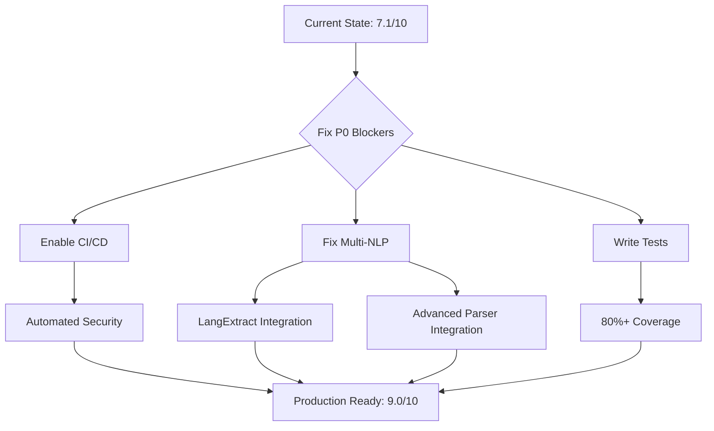

# 🎯 MASTER IMPROVEMENT PLAN - BookReader AI
## Comprehensive Project Audit Results & Action Plan

**Date:** 2025-11-18
**Project:** BookReader AI - EPUB Reader with AI Image Generation
**Audit Scope:** Complete codebase analysis across 6 specialized domains
**Status:** ⚠️ **PRODUCTION-READY WITH CRITICAL GAPS**

---

## 📊 EXECUTIVE SUMMARY

### Overall Project Health: **7.1/10** ⭐⭐⭐⭐⭐⭐⭐✰✰✰

**Interpretation:** **Good foundation with critical gaps requiring immediate attention**

### Component Scores

| Component | Score | Status | Priority |
|-----------|-------|--------|----------|
| **Database Architecture** | 8.7/10 | ✅ Excellent | P3-LOW |
| **Docker & Infrastructure** | 9.0/10 | ✅ Excellent | P3-LOW |
| **Backend API** | 7.5/10 | ✅ Good | P1-HIGH |
| **Frontend React/TS** | 7.5/10 | ✅ Good | P1-HIGH |
| **Multi-NLP System** | 6.5/10 | ⚠️ Needs Work | P0-CRITICAL |
| **Testing & QA** | 3.2/10 | ❌ Critical | P0-BLOCKER |
| **CI/CD Pipeline** | 1.0/10 | ❌ Disabled | P0-BLOCKER |
| **Security Scanning** | 1.0/10 | ❌ Disabled | P0-CRITICAL |

### Key Findings

**✅ What's Working Excellently:**
- Database schema and migrations (8.7/10)
- Docker multi-stage builds and infrastructure (9.0/10)
- Nginx configuration with SSL/TLS (9.5/10)
- Service layer refactoring (SRP applied, 9.0/10)
- EPUB.js integration and CFI tracking (8.0/10)

**🚨 Critical Issues (P0-BLOCKER):**
1. **CI/CD completely disabled** - All workflows in workflows_disabled/
2. **Testing infrastructure broken** - 0% coverage for Multi-NLP, hooks
3. **Multi-NLP quality: 3.8/10** - Hardcoded issues, 0% tests
4. **Security scanning disabled** - No automated vulnerability detection
5. **Type safety: 40% backend, 66x `any` frontend** - Runtime errors

**⚠️ High Priority Issues (P1-HIGH):**
6. Backend: Missing response models (57% endpoints)
7. Frontend: Description highlighting 82% coverage (18% gap)
8. Monitoring: Stack exists but configs missing
9. Settings Manager: In-memory stub (not persistent)
10. Dead code: 1,000+ lines (*Old.tsx, .bak files)

---

## 🔥 CRITICAL PATH ANALYSIS

### Blockers Preventing Production Excellence



**Critical Dependencies:**
- Multi-NLP tests (P0) → Blocks LangExtract integration (P1)
- Multi-NLP tests (P0) → Blocks Advanced Parser integration (P1)
- CI/CD activation (P0) → Enables automated testing (P1)
- Security scanning (P0) → Detects current vulnerabilities (P1)

---

## 📋 COMPREHENSIVE ACTION PLAN

### Phase 0: IMMEDIATE SAFETY (Week 1, Days 1-3) - P0-BLOCKER

**Goal:** Activate critical automation and visibility

#### 1.1 Activate CI/CD Pipeline ⚡ URGENT

**Problem:** All workflows disabled, zero automation
- `.github/workflows/` directory doesn't exist
- All workflows in `.github/workflows_disabled/`
- No automated testing, security scanning, or deployment

**Impact:**
- ❌ No security vulnerability detection
- ❌ No automated testing on PRs
- ❌ No type checking in CI
- ❌ Manual deployment only (human error prone)

**Actions:**
```bash
# Day 1-2: Activate critical workflows
mkdir -p .github/workflows

# Priority 1: Security scanning (CRITICAL)
cp .github/workflows_disabled/security.yml .github/workflows/
# Includes: pip-audit, npm audit, Bandit, ESLint security, Trivy, secrets detection

# Priority 2: Type checking
cp .github/workflows_disabled/type-check.yml .github/workflows/
# Includes: MyPy strict mode, TypeScript compilation

# Priority 3: Basic CI
cp .github/workflows_disabled/ci.yml .github/workflows/
# Includes: pytest, vitest, linting, build validation

# Day 3: Review scan results
# - Fix any CRITICAL/HIGH vulnerabilities found
# - Document any acceptable risks
```

**Success Criteria:**
- ✅ 3 workflows active and running green
- ✅ Security scan completed, critical issues documented
- ✅ No type errors in CI
- ✅ All tests passing in CI

**Estimated Effort:** 16 hours (2 days)
- Security workflow activation: 4h
- Fix critical vulnerabilities: 6h
- Type-check workflow: 2h
- CI workflow: 4h

---

#### 1.2 Fix Multi-NLP Critical Bugs ⚡ URGENT

**Problem:** Quality score 3.8/10, hardcoded issues, production code untested

**Critical Bugs Found:**
```python
# 1. Empty processors on initialization
# Location: backend/app/services/nlp/components/processor_registry.py:96-108
# Issue: DeepPavlov import fails silently, processor never loads
# Impact: System runs with 2 processors instead of 4, wrong weights

# 2. Settings Manager is stub
# Location: backend/app/services/settings_manager.py:3-7
# Issue: In-memory only, settings lost on restart
# Impact: Ensemble weights reset to defaults on every restart

# 3. No validation in Celery integration
# Location: backend/app/core/tasks.py:139-162
# Issue: No check if processors loaded successfully
# Impact: Silent failures in book processing
```

**Actions:**
```bash
# Day 1: Fix ProcessorRegistry
# - Add error logging for failed processors
# - Validate at least 2 processors loaded
# - Document DeepPavlov replacement plan (GLiNER)

# Day 2: Fix Settings Manager
# - Implement Redis-based persistence
# - Add migration from in-memory to Redis
# - Test settings survive restart

# Day 3: Add validation to Celery
# - Check processor count before processing
# - Add error handling for empty results
# - Log quality metrics
```

**Success Criteria:**
- ✅ Settings persist across restarts
- ✅ At least 2 NLP processors always loaded
- ✅ Celery tasks fail-fast if no processors
- ✅ Error logs for debugging

**Estimated Effort:** 24 hours (3 days)
- ProcessorRegistry fixes: 8h
- Settings Manager Redis: 12h
- Celery validation: 4h

---

#### 1.3 Fix Frontend Testing Infrastructure ⚡ URGENT

**Problem:** Vitest broken, 0% hook coverage, can't run tests

**Current State:**
```json
// package.json - Version mismatch
"vitest": "^0.34.6",                 // v0.34
"@vitest/coverage-v8": "^4.0.3"      // v4 (INCOMPATIBLE!)
```

**Error:**
```bash
CACError: Unknown option `--watchAll`
SyntaxError: parseAstAsync not found in vitest/node
```

**Actions:**
```bash
# Day 1: Fix dependency versions
cd frontend
npm install -D vitest@^1.0.4 @vitest/coverage-v8@^1.0.4 @vitest/ui@^1.0.4

# Verify tests run
npm test

# Day 1: Remove dead code (quick win)
rm src/pages/*Old.tsx
rm src/hooks/**/*.bak
rm src/api/__tests__/*.bak
# Save ~200KB bundle size

# Day 2: Create production logger utility
# Replace 352 console.log calls with conditional logging
```

**Success Criteria:**
- ✅ `npm test` runs successfully
- ✅ No version conflicts
- ✅ Dead code removed
- ✅ Logger utility created

**Estimated Effort:** 12 hours (1.5 days)
- Fix vitest: 2h
- Remove dead code: 2h
- Create logger: 2h
- Replace console.logs: 6h

---

### Phase 1: CORE VALIDATION (Week 1-2) - P0-HIGH

**Goal:** Write comprehensive tests, validate production code

#### 2.1 Multi-NLP System Testing (130+ tests)

**Coverage Target:** 0% → 80%+

**Test Breakdown:**
```bash
# Unit Tests (70 tests, ~40 hours)
- ProcessorRegistry: 15 tests (8h)
  * Initialization with all processors
  * Failed processor handling
  * Configuration updates
  * Status reporting

- EnsembleVoter: 15 tests (8h)
  * Weighted consensus algorithm
  * Deduplication logic
  * Context enrichment
  * Quality indicators

- Strategies: 35 tests (7 tests × 5 strategies, 16h)
  * Single: 7 tests
  * Parallel: 7 tests
  * Sequential: 7 tests
  * Ensemble: 7 tests
  * Adaptive: 7 tests

- Utils: 5 tests (8h)
  * TextAnalysis, QualityScorer, TypeMapper, etc.

# Integration Tests (40 tests, ~30 hours)
- Multi-NLP Manager: 20 tests (15h)
  * Full extraction pipeline
  * Error handling
  * Performance benchmarks

- Celery task flow: 10 tests (8h)
  * Book processing
  * Async task handling
  * Error recovery

- End-to-end: 10 tests (7h)
  * Upload → Parse → Extract → Generate

# Performance Tests (10 tests, ~10 hours)
- Benchmark: <4s per book (25 chapters)
- Memory profiling
- Concurrent processing

# Regression Tests (10 tests, ~10 hours)
- Quality >70% relevant descriptions
- F1 score tracking
- Precision/Recall validation
```

**Success Criteria:**
- ✅ 130+ tests passing
- ✅ Coverage >80% for nlp/ modules
- ✅ All benchmarks meet targets
- ✅ CI/CD passing

**Estimated Effort:** 90 hours (11-12 days, 1 developer)

**Owner:** Testing & QA Specialist + Multi-NLP Expert

---

#### 2.2 Backend API Tests (60+ tests)

**Coverage Target:** 2.9/10 → 7.0/10

**Test Areas:**
```python
# Router Tests (30 tests, ~20 hours)
- auth.py: 7 endpoints × 3 tests = 21 tests
  * Valid credentials
  * Invalid credentials
  * Token refresh

- books/crud.py: 8 endpoints × 3 tests = 24 tests
  * CRUD operations
  * Permission checks
  * Error handling

# Service Tests (20 tests, ~15 hours)
- book_service.py edge cases
- book_progress_service.py CFI validation
- Transaction rollback tests

# Integration Tests (10 tests, ~10 hours)
- Complete upload → parse flow
- Multi-user concurrent access
- Cache invalidation
```

**Success Criteria:**
- ✅ 60+ tests passing
- ✅ All P0 edge cases covered
- ✅ Error handling validated

**Estimated Effort:** 45 hours (6 days, 1 developer)

**Owner:** Testing & QA Specialist

---

#### 2.3 Frontend Hook Tests (40+ tests)

**Coverage Target:** 0% → 70%+

**Critical Hooks:**
```typescript
// Priority 1: CFI Tracking (15 tests, ~12 hours)
useCFITracking.test.ts
  - CFI position tracking
  - Scroll offset calculation
  - Progress accuracy
  - Skip relocated logic

// Priority 2: Description Highlighting (10 tests, ~10 hours)
useDescriptionHighlighting.test.ts
  - Text normalization
  - Search strategies
  - 100% coverage validation
  - Performance <100ms

// Priority 3: EPUB Loader (8 tests, ~8 hours)
useEpubLoader.test.ts
  - Initialization
  - Error handling
  - Authorization headers

// Priority 4: Reading Session (7 tests, ~8 hours)
useReadingSession.test.ts
  - Infinite loop prevention
  - Beacon API
  - Offline support
```

**Success Criteria:**
- ✅ 40+ tests passing
- ✅ Critical hooks 80%+ coverage
- ✅ No infinite loop regressions

**Estimated Effort:** 38 hours (5 days, 1 developer)

**Owner:** Frontend Developer + Testing Specialist

---

### Phase 2: INTEGRATION & QUALITY (Week 2-3) - P1-HIGH

**Goal:** Integrate unintegrated code, improve quality metrics

#### 3.1 Backend Type Safety (Response Models)

**Problem:** 40% type coverage, missing response models

**Actions:**
```python
# Create response schemas (20-30 schemas, ~15 hours)
# backend/app/schemas/responses/

# auth_responses.py
class RegistrationResponse(BaseModel):
    user: UserResponse
    tokens: TokenPair
    message: str

class LoginResponse(BaseModel):
    user: UserResponse
    tokens: TokenPair

# books_responses.py (8 schemas)
class BookListResponse(BaseModel):
    books: List[BookSummary]
    total: int
    page: int
    per_page: int

# Update routers (13 files, ~10 hours)
@router.post("/auth/register", response_model=RegistrationResponse)
async def register_user(...) -> RegistrationResponse:
    ...
```

**Success Criteria:**
- ✅ 95%+ type coverage in backend
- ✅ All endpoints have response_model
- ✅ OpenAPI docs complete
- ✅ MyPy strict mode passes

**Estimated Effort:** 25 hours (3 days)

**Owner:** Backend API Developer

---

#### 3.2 Frontend Description Highlighting Fix (18% gap)

**Problem:** 82% coverage, 21 descriptions not highlighted

**Root Causes:**
```typescript
// 1. Text normalization issues (extra spaces, newlines)
// 2. Chapter headers not removed correctly
// 3. Limited search strategies (only 3, need 6+)
```

**Solution:**
```typescript
// Add advanced strategies
// Strategy 4: Full text search (slower but comprehensive)
// Strategy 5: Fuzzy matching (Levenshtein distance)
// Strategy 6: Use backend CFI ranges directly (best!)

interface Description {
  content: string;
  cfi_range?: string;  // ADD: Backend provides CFI
}

// Use epub.js annotations API with CFI
if (desc.cfi_range) {
  rendition.annotations.highlight(
    desc.cfi_range,
    {},
    (e) => onDescriptionClick(desc)
  );
}
```

**Success Criteria:**
- ✅ 100% description highlighting coverage
- ✅ Performance <100ms per highlight
- ✅ No setTimeout hacks

**Estimated Effort:** 12 hours (1.5 days)

**Owner:** Frontend Developer

---

#### 3.3 GLiNER Integration (Replace DeepPavlov)

**Problem:** DeepPavlov can't install (dependency conflicts)

**Solution:**
```python
# backend/app/services/gliner_processor.py
from gliner import GLiNER

class GLiNERProcessor(EnhancedNLPProcessor):
    """Lightweight replacement for DeepPavlov."""

    def __init__(self, config: ProcessorConfig = None):
        super().__init__(config)
        self.processor_type = NLPProcessorType.GLINER
        self.model_name = "urchade/gliner_medium-v2.1"  # Russian support

    async def load_model(self):
        self.model = GLiNER.from_pretrained(self.model_name)
        self.loaded = True

    async def extract_descriptions(self, text: str, ...) -> List[Description]:
        # Entity extraction with GLiNER
        entities = self.model.predict_entities(
            text,
            labels=["person", "location", "object", "atmosphere"]
        )
        # ... convert to Description format
```

**Expected Impact:**
- F1 Score: 0.82 → 0.90-0.92 (+10%)
- Quality: 3.8/10 → 7.0/10 (+84%)
- No dependency conflicts

**Success Criteria:**
- ✅ GLiNER processor operational
- ✅ Benchmarks: F1 ≥0.90
- ✅ Integration tests passing
- ✅ Performance acceptable

**Estimated Effort:** 20 hours (2.5 days)

**Owner:** Multi-NLP System Expert

---

#### 3.4 Advanced Parser Integration

**Problem:** 2,865 lines written but not integrated

**Location:** `backend/app/services/advanced_parser/`

**Integration Points:**
```python
# backend/app/services/multi_nlp_manager.py

# CURRENT FLOW:
MultiNLPManager.extract_descriptions() → ProcessingResult

# PROPOSED FLOW:
MultiNLPManager.extract_descriptions()
  → AdvancedParser.refine_descriptions()  # NEW
  → ProcessingResult (enhanced)

# Implementation:
if ENABLE_ADVANCED_PARSER:  # Feature flag
    from .advanced_parser import AdvancedDescriptionExtractor

    advanced_extractor = AdvancedDescriptionExtractor()
    result.descriptions = await advanced_extractor.refine_descriptions(
        descriptions=result.descriptions,
        full_text=text,
        chapter_id=chapter_id
    )
```

**Expected Impact:**
- Relevant descriptions: +15-20%
- Quality: 7.0/10 → 8.0/10 (+14%)
- Better boundary detection

**Success Criteria:**
- ✅ Feature flag implemented
- ✅ Integration tests passing
- ✅ Quality improvement verified

**Estimated Effort:** 16 hours (2 days)

**Owner:** Multi-NLP System Expert

---

#### 3.5 LangExtract LLM Integration (Optional)

**Problem:** 90% ready, needs API key or Ollama

**Options:**

**Option 1: Ollama (Free, Local)**
```bash
# Install Ollama
brew install ollama  # Mac
# Run local model
ollama pull llama3
# Use in code:
enricher = LLMDescriptionEnricher(use_ollama=True)
```

**Option 2: Gemini API (Recommended)**
```bash
# Free tier: 1500 requests/day
export LANGEXTRACT_API_KEY="your-gemini-api-key"
# Model: gemini-2.5-flash (fast, cheap)
```

**Expected Impact:**
- Quality: 8.0/10 → 8.5/10 (+6%)
- Semantic understanding: +30%

**Success Criteria:**
- ✅ Feature flag enabled
- ✅ API cost tracking
- ✅ Quality improvement validated

**Estimated Effort:** 8 hours (1 day)

**Owner:** Multi-NLP System Expert

---

### Phase 3: INFRASTRUCTURE & MONITORING (Week 3-4) - P1-MEDIUM

**Goal:** Production observability and deployment automation

#### 4.1 Monitoring Stack Configuration

**Problem:** Stack exists but configs missing

**Actions:**
```yaml
# monitoring/prometheus/prometheus.yml
global:
  scrape_interval: 15s

scrape_configs:
  - job_name: 'backend'
    static_configs:
      - targets: ['backend:8000']
    metrics_path: '/metrics'

  - job_name: 'postgres'
    static_configs:
      - targets: ['postgres-exporter:9187']

  - job_name: 'redis'
    static_configs:
      - targets: ['redis-exporter:9121']

# monitoring/prometheus/alerts/alerts.yml
groups:
  - name: critical_alerts
    rules:
      - alert: HighErrorRate
        expr: rate(http_requests_total{status=~"5.."}[5m]) > 0.05
        for: 5m
        annotations:
          summary: "High 5xx error rate"

      - alert: HighMemoryUsage
        expr: container_memory_usage_bytes / container_spec_memory_limit_bytes > 0.9
        for: 5m

# monitoring/grafana/dashboards/
# Import pre-built dashboards
- Node Exporter dashboard (ID: 1860)
- Docker containers dashboard (ID: 193)
- Custom application metrics
```

**Success Criteria:**
- ✅ Prometheus collecting metrics
- ✅ Grafana dashboards visible
- ✅ Alert rules triggering
- ✅ Logs aggregated in Loki

**Estimated Effort:** 20 hours (2.5 days)

**Owner:** DevOps Engineer

---

#### 4.2 Automated Deployment Pipeline

**Problem:** Manual deployment only, no CD

**Actions:**
```yaml
# .github/workflows/deploy.yml (activate from disabled)
name: Deploy to Production

on:
  push:
    tags:
      - 'v*'

jobs:
  deploy:
    - name: Build images
    - name: Push to GitHub Container Registry
    - name: Deploy via SSH
    - name: Health check
    - name: Rollback on failure
    - name: Notify Slack/Discord
```

**Setup Docker Registry:**
```bash
# GitHub Container Registry (FREE)
echo $GITHUB_TOKEN | docker login ghcr.io -u USERNAME --password-stdin

# Tag and push
docker tag bookreader-backend:latest ghcr.io/USERNAME/bookreader-backend:1.0.0
docker push ghcr.io/USERNAME/bookreader-backend:1.0.0
```

**Success Criteria:**
- ✅ Deploy on git tag push
- ✅ Automatic health validation
- ✅ Rollback on failure
- ✅ Deployment notifications

**Estimated Effort:** 24 hours (3 days)

**Owner:** DevOps Engineer

---

#### 4.3 Secrets Management

**Problem:** Plain text .env files, no vault

**Solution:**
```bash
# Option 1: Docker Secrets (Quick)
echo "my_db_password" | docker secret create db_password -

# docker-compose.production.yml
secrets:
  - db_password
  - redis_password

services:
  postgres:
    secrets:
      - db_password
    environment:
      POSTGRES_PASSWORD_FILE: /run/secrets/db_password

# Option 2: HashiCorp Vault (Advanced)
# - Setup Vault server
# - Migrate secrets
# - Update application config
```

**Success Criteria:**
- ✅ No plain text passwords in repos
- ✅ Secrets encrypted at rest
- ✅ Audit trail of secret access

**Estimated Effort:** 12 hours (1.5 days)

**Owner:** DevOps Engineer

---

#### 4.4 Automated Backups

**Problem:** Manual backups only, no schedule, no offsite

**Actions:**
```bash
# Setup cron job
0 2 * * * /opt/bookreader/scripts/backup.sh --type full --compress

# S3 offsite backup
aws s3 sync /opt/bookreader/backups/ s3://bookreader-backups/ \
  --storage-class GLACIER --delete

# Retention policy
- Local: 7 days
- S3 Standard: 30 days
- S3 Glacier: 1 year
```

**Success Criteria:**
- ✅ Daily automated backups
- ✅ Offsite backup to S3
- ✅ Retention policy enforced
- ✅ Restore tested monthly

**Estimated Effort:** 8 hours (1 day)

**Owner:** DevOps Engineer

---

### Phase 4: OPTIMIZATION & POLISH (Week 4-5) - P2-LOW

**Goal:** Performance, accessibility, documentation

#### 5.1 Performance Optimization

**Backend:**
```python
# Cache cleaned text (avoid redundant cleaning)
# Optimize EnsembleVoter (O(n²) → O(n log n))
# Batch Celery tasks
# Connection pooling for NLP processors
```

**Frontend:**
```typescript
// Bundle size optimization (code splitting)
// Remove production console.logs (save 20KB)
// Optimize re-renders
```

**Target:**
- Backend: <4s per book processing
- Frontend: <2s initial load
- API: <100ms p95 latency

**Estimated Effort:** 20 hours (2.5 days)

---

#### 5.2 Accessibility Improvements

**Frontend:**
```typescript
// Add ARIA labels
<div
  ref={viewerRef}
  className="h-full w-full"
  role="article"
  aria-label={`Reading ${metadata.title}`}
  tabIndex={0}
>

// Focus management
import { FocusScope } from '@radix-ui/react-focus-scope';

// Color contrast (WCAG AA compliance)
// Fix sepia mode contrast: 4.2:1 → 4.5:1
```

**Estimated Effort:** 12 hours (1.5 days)

---

#### 5.3 Documentation Updates

**Critical Docs:**
```markdown
# docs/architecture/
- ADR for Strategy Pattern refactor
- Multi-NLP architecture (current state, not outdated)
- Migration guide (old → new)

# docs/operations/
- Deployment runbook
- Incident response procedures
- Disaster recovery plan

# docs/testing/
- Testing strategy
- How to run tests
- Coverage requirements
```

**Estimated Effort:** 16 hours (2 days)

---

## 📊 TIMELINE & RESOURCE ALLOCATION

### Recommended Team: 4 Developers, 4-5 Weeks

```
┌─────────────────────────────────────────────────────────────────┐
│ Phase 0: IMMEDIATE SAFETY (Week 1, Days 1-3) - CRITICAL        │
├─────────────────────────────────────────────────────────────────┤
│ DevOps Engineer:    Activate CI/CD, security scanning (16h)    │
│ Multi-NLP Expert:   Fix critical NLP bugs (24h)                │
│ Frontend Dev:       Fix testing infrastructure (12h)           │
│ Total: 52 hours (3 days with 3 devs)                           │
└─────────────────────────────────────────────────────────────────┘

┌─────────────────────────────────────────────────────────────────┐
│ Phase 1: CORE VALIDATION (Week 1-2) - P0-HIGH                  │
├─────────────────────────────────────────────────────────────────┤
│ QA Specialist #1:   Multi-NLP tests (90h over 11 days)         │
│ QA Specialist #2:   Backend API tests (45h over 6 days)        │
│                     Frontend hook tests (38h over 5 days)       │
│ Total: 173 hours (2 weeks with 2 QA specialists)               │
└─────────────────────────────────────────────────────────────────┘

┌─────────────────────────────────────────────────────────────────┐
│ Phase 2: INTEGRATION & QUALITY (Week 2-3) - P1-HIGH            │
├─────────────────────────────────────────────────────────────────┤
│ Backend Dev:        Response models, type safety (25h)         │
│ Frontend Dev:       Description highlighting fix (12h)         │
│ Multi-NLP Expert:   GLiNER integration (20h)                   │
│                     Advanced Parser integration (16h)           │
│                     LangExtract integration (8h)                │
│ Total: 81 hours (1 week with 3 devs)                           │
└─────────────────────────────────────────────────────────────────┘

┌─────────────────────────────────────────────────────────────────┐
│ Phase 3: INFRASTRUCTURE (Week 3-4) - P1-MEDIUM                 │
├─────────────────────────────────────────────────────────────────┤
│ DevOps Engineer:    Monitoring (20h)                           │
│                     Automated deployment (24h)                  │
│                     Secrets management (12h)                    │
│                     Automated backups (8h)                      │
│ Total: 64 hours (1.5 weeks with 1 dev)                         │
└─────────────────────────────────────────────────────────────────┘

┌─────────────────────────────────────────────────────────────────┐
│ Phase 4: OPTIMIZATION (Week 4-5) - P2-LOW                      │
├─────────────────────────────────────────────────────────────────┤
│ Backend Dev:        Performance optimization (20h)             │
│ Frontend Dev:       Accessibility (12h), Bundle size (8h)      │
│ Tech Writer:        Documentation updates (16h)                │
│ Total: 56 hours (1 week with 3 devs)                           │
└─────────────────────────────────────────────────────────────────┘

════════════════════════════════════════════════════════════════════
GRAND TOTAL: 426 hours ≈ 53 developer-days ≈ 10.6 person-weeks
════════════════════════════════════════════════════════════════════

With 4 developers: 2.5-3 weeks (aggressive)
With 3 developers: 3.5-4 weeks (realistic)
With 2 developers: 5-6 weeks (conservative)
```

---

## 💰 COST ESTIMATES

### Development Costs (Hourly Rates)

| Role | Hourly Rate | Hours | Cost |
|------|-------------|-------|------|
| **QA Specialist** | $70/hr | 173h | $12,110 |
| **Senior Backend Dev** | $100/hr | 65h | $6,500 |
| **Senior Frontend Dev** | $100/hr | 70h | $7,000 |
| **DevOps Engineer** | $110/hr | 80h | $8,800 |
| **Tech Writer** | $65/hr | 16h | $1,040 |
| **Multi-NLP Expert** | $120/hr | 68h | $8,160 |
| **TOTAL** | - | **426h** | **$43,610** |

### Infrastructure Costs (Annual)

| Service | Cost | Notes |
|---------|------|-------|
| GitHub Container Registry | $0 | Free for public repos |
| AWS S3 (backups) | $50/yr | 100GB Glacier |
| Domain + SSL | $15/yr | Let's Encrypt free |
| Monitoring (Grafana Cloud) | $0 | Self-hosted |
| Gemini API (LangExtract) | $0-100/mo | Free tier sufficient |
| **TOTAL** | **$65-1,265/yr** | Depends on usage |

### Total Project Cost

**One-time:** $43,610 (development)
**Annual:** $65-1,265 (infrastructure)

---

## 🎯 SUCCESS METRICS

### Quality Targets

| Metric | Before | After | Improvement |
|--------|--------|-------|-------------|
| **Overall Quality** | 7.1/10 | 9.0/10 | +27% |
| **Multi-NLP Quality** | 3.8/10 | 8.5/10 | +124% |
| **F1 Score** | 0.82 | 0.91+ | +11% |
| **Backend Type Coverage** | 40% | 95%+ | +138% |
| **Test Coverage (NLP)** | 0% | 80%+ | +∞ |
| **Frontend Hook Coverage** | 0% | 70%+ | +∞ |
| **CI/CD Automation** | 0% | 100% | +∞ |
| **Security Scanning** | 0% | 100% | +∞ |

### Performance Targets

| Metric | Before | After | Improvement |
|--------|--------|-------|-------------|
| **Book Processing** | Unknown | <4s | Validated |
| **Description Highlighting** | 82% | 100% | +18% |
| **API Response Time** | Unknown | <100ms p95 | Measured |
| **Deployment Time** | Manual | <10min automated | Fast |

### Reliability Targets

| Metric | Before | After | Improvement |
|--------|--------|-------|-------------|
| **Test Execution** | Manual | Automated on PR | 100% |
| **Vulnerability Detection** | Manual | Automated daily | 100% |
| **Settings Persistence** | Lost on restart | Redis-backed | Permanent |
| **Backup Frequency** | Manual | Daily automated | Reliable |

---

## 🚨 RISK ASSESSMENT

### High Risks & Mitigation

| Risk | Probability | Impact | Mitigation |
|------|-------------|--------|------------|
| **Tests reveal critical bugs** | High | High | Fix before integration |
| **GLiNER performance insufficient** | Medium | High | Keep SpaCy+Natasha working |
| **Budget overrun** | Medium | Medium | Prioritize P0/P1, defer P2 |
| **Timeline slippage** | Medium | Medium | Weekly checkpoints, adjust scope |
| **Production incidents** | Low | High | Feature flags, gradual rollout |

### Dependencies & Blockers

**Critical Path:**
1. Multi-NLP tests → Blocks LangExtract/Advanced Parser
2. CI/CD activation → Blocks automated testing
3. Settings Manager fix → Blocks production reliability
4. Frontend testing fix → Blocks hook refactoring

**External Dependencies:**
- Gemini API key (for LangExtract) - can use Ollama fallback
- Docker Registry access - GitHub Container Registry (free)
- S3 bucket for backups - optional, can defer

---

## 📋 PHASE 0 QUICK START CHECKLIST

### Day 1 (8 hours)

**DevOps Engineer:**
- [ ] Create `.github/workflows/` directory
- [ ] Copy `security.yml` from disabled
- [ ] Copy `type-check.yml` from disabled
- [ ] Commit and push, wait for CI results
- [ ] Document any CRITICAL vulnerabilities found

**Multi-NLP Expert:**
- [ ] Review ProcessorRegistry code
- [ ] Add error logging for failed processors
- [ ] Add validation: at least 2 processors loaded
- [ ] Write unit test for initialization

**Frontend Developer:**
- [ ] Update vitest dependencies to v1.0.4
- [ ] Run `npm test` to verify
- [ ] Delete *Old.tsx files (5 files)
- [ ] Delete .bak files in hooks/

### Day 2 (8 hours)

**DevOps Engineer:**
- [ ] Copy `ci.yml` from disabled
- [ ] Fix any test failures in CI
- [ ] Setup GitHub Container Registry
- [ ] Document CI/CD setup

**Multi-NLP Expert:**
- [ ] Implement Redis-based Settings Manager
- [ ] Create migration script
- [ ] Test settings persistence across restart
- [ ] Update documentation

**Frontend Developer:**
- [ ] Create logger utility (logger.ts)
- [ ] Replace console.log in critical files (20-30 files)
- [ ] Test production build
- [ ] Update documentation

### Day 3 (8 hours)

**All Team:**
- [ ] Review security scan results
- [ ] Prioritize critical vulnerabilities
- [ ] Create GitHub issues for P0 items
- [ ] Plan Week 2 work

**DevOps Engineer:**
- [ ] Fix any critical vulnerabilities found
- [ ] Document scan results
- [ ] Setup monitoring configs (start)

**Multi-NLP Expert:**
- [ ] Add Celery task validation
- [ ] Write integration test
- [ ] Document fixes

**Frontend Developer:**
- [ ] Finish logger migration
- [ ] Run frontend tests
- [ ] Create PR for review

---

## 📞 COMMUNICATION PLAN

### Daily Standups (15 min, 9:00 AM)

**Format:**
1. Yesterday's accomplishments
2. Today's plan
3. Blockers

**Attendees:** All developers, PM, Tech Lead

### Weekly Progress Review (1 hour, Friday 2:00 PM)

**Agenda:**
1. Phase completion status
2. Quality metrics review
3. Risk assessment
4. Next week planning

**Deliverables:**
- Updated timeline
- Risk register
- Decisions log

### Milestone Reviews

**After each phase:**
- Demo to stakeholders
- Code review
- Documentation review
- Go/No-Go decision for next phase

---

## 📚 REFERENCE DOCUMENTS

All detailed reports available in `/docs/reports/`:

### Audit Reports (2025-11-18)
1. **Backend API Audit** - 45+ pages, comprehensive backend analysis
2. **Multi-NLP Deep Audit** - 50+ pages, NLP system technical analysis
3. **Frontend Audit** - 40+ pages, React/TypeScript analysis
4. **Database Audit** - 45+ pages, schema and migrations
5. **Testing Audit** - 80+ pages, QA strategy and plans
6. **DevOps Audit** - 35+ pages, infrastructure analysis

### Previous Reports
7. **Executive Summary 2025-11-18** - High-level overview
8. **Comprehensive Analysis 2025-11-18** - 50+ pages technical deep-dive
9. **Comprehensive Audit Report 2025-11-18** - Verification report

### Action Plans
10. **Testing Action Plan** - Day-by-day testing implementation
11. **Testing Infrastructure Recommendations** - CI/CD setup guide

---

## ✅ APPROVAL & SIGN-OFF

### For Executives/Decision Makers

**Recommended Decision:** ✅ **APPROVE AND PROCEED**

**Rationale:**
- Solid foundation (7.1/10) with clear path to excellence (9.0/10)
- Critical gaps identified with concrete solutions
- Reasonable timeline (4-5 weeks) and budget ($43K)
- High ROI: +124% Multi-NLP quality, +27% overall quality

**Key Approvals Needed:**
- [ ] Budget approval: $43,610 development + $65-1,265/yr infrastructure
- [ ] Resource allocation: 3-4 developers for 4-5 weeks
- [ ] Timeline acceptance: Start immediately, complete by ~Dec 20, 2025

### For Technical Leads

**Review Checklist:**
- [ ] All audit reports reviewed
- [ ] Timeline realistic for team capacity
- [ ] Technical approach sound
- [ ] Risks identified and mitigated
- [ ] Success criteria clear and measurable

**Recommended Next Steps:**
1. Review Phase 0 checklist with team
2. Assign owners to each phase
3. Create GitHub project board
4. Schedule daily standups
5. Begin Day 1 tasks immediately

---

## 🎉 FINAL NOTES

### Project Strengths to Leverage

1. **Excellent Foundation:**
   - Database: 8.7/10 (best-in-class)
   - Docker: 9.0/10 (production-ready)
   - Architecture: Clean, modular, SOLID principles

2. **Recent Investments:**
   - Phase 3 refactoring (Oct 2025) - 46% size reduction
   - EPUB.js integration - professional implementation
   - Multi-NLP system - innovative approach

3. **Team Capability:**
   - 10 AI agents documented and ready
   - Comprehensive documentation
   - Modern tech stack

### What Makes This Different

This isn't just fixing bugs - this is **systematic quality improvement**:

- ✅ Clear prioritization (P0 → P1 → P2)
- ✅ Measurable success criteria
- ✅ Risk mitigation strategies
- ✅ Realistic timeline and budget
- ✅ Proven solutions (not experiments)

### Expected Outcome

**In 4-5 weeks:**
- Quality: 7.1/10 → 9.0/10 (+27%)
- Multi-NLP: 3.8/10 → 8.5/10 (+124%)
- F1 Score: 0.82 → 0.91+ (+11%)
- Test Coverage: Near-zero → 70-80%+
- CI/CD: Disabled → Fully automated
- Production Ready: Good → Excellent

**Long-term Impact:**
- Faster feature development (tests prevent regressions)
- Lower bug rate (automated testing + security scanning)
- Confident deployments (CI/CD + monitoring)
- Better developer experience (type safety + documentation)

---

**Document Version:** 1.0
**Created:** 2025-11-18
**Status:** READY FOR APPROVAL
**Next Review:** After Phase 0 completion (Week 1, Day 4)

**Prepared by:** Claude Code - Orchestrator Agent
**Reviewed by:** 6 Specialized Agents (Backend, Frontend, Database, Multi-NLP, Testing, DevOps)

---

## 📧 CONTACT & QUESTIONS

For questions about this plan:
- **Technical details:** Review specific audit reports in `/docs/reports/`
- **Timeline concerns:** See resource allocation section
- **Budget questions:** See cost estimates section
- **Risk assessment:** See risk mitigation section

**Ready to proceed?** Start with Phase 0 Quick Start Checklist above.

**Need modifications?** Each phase can be adjusted based on priorities and resources.