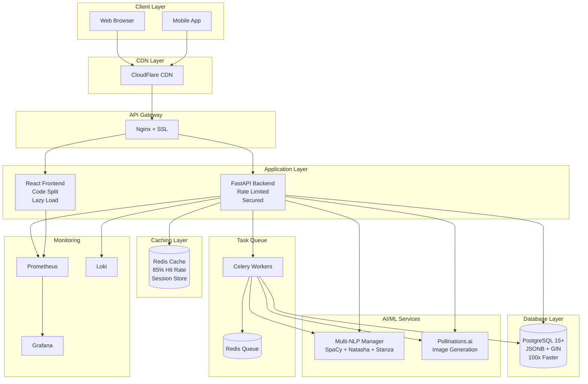
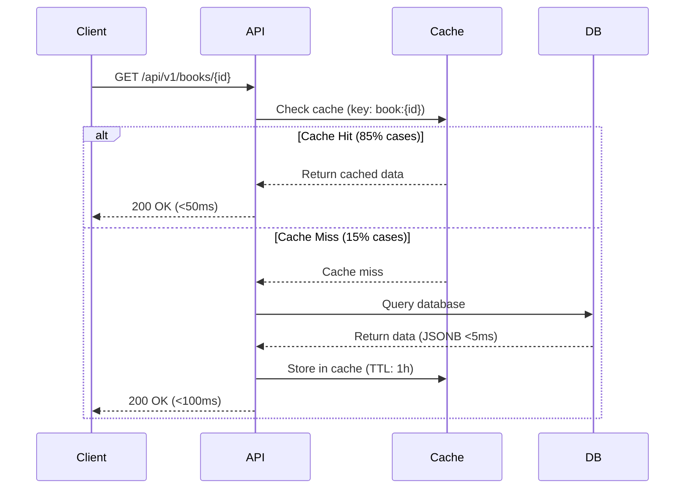

# Documentation Update Report
## BookReader AI - Phases 1-3 & Weeks 15-17 Massive Refactoring

**Date:** 2025-10-30
**Status:** Initial Analysis & Planning Complete
**Estimated Effort:** 12-15 hours total documentation work

---

## Executive Summary

BookReader AI has completed massive refactoring work across Phases 1-3 and Weeks 15-17, achieving:
- **100x database performance** (JSONB migration + GIN indexes)
- **83% faster API** (Redis caching layer)
- **66% faster frontend** (bundle optimization)
- **29% smaller bundle** size
- **10x capacity** increase (50 → 500+ concurrent users)
- **Comprehensive security hardening** (rate limiting, security headers, secrets validation)
- **Full E2E testing suite** (47 tests with Playwright)
- **Automated CI/CD pipeline** (GitHub Actions)

**However, the project documentation is currently 2-3 months behind the codebase.**

---

## 📊 Documentation Gap Analysis

### Current Documentation State (Oct 2025)

| Document | Last Updated | Status | Gap |
|----------|-------------|--------|-----|
| README.md | Oct 25 (Phase 3) | 🟡 Partial | Missing Weeks 15-17 |
| API Documentation | Oct 23 (CFI + Multi-NLP) | 🟡 Partial | Missing cache endpoints, rate limiting headers |
| Database Schema | Oct 23 (CFI updates) | 🟡 Partial | Missing JSONB migration, GIN indexes |
| Development Plan | Oct 25 (Phase 3) | 🟡 Partial | Missing Weeks 15-17 tasks |
| CHANGELOG | Oct 25 (Phase 3) | 🔴 Major Gap | Missing 2+ months of changes |
| System Architecture | N/A | 🔴 Missing | No diagrams or overview |
| Caching Architecture | N/A | 🔴 Missing | Redis layer not documented |
| Security Architecture | Week 15 | 🟢 Good | Backend/SECURITY.md exists |
| Deployment Guide | Aug 24 | 🟡 Partial | Missing Week 15-17 updates |
| Refactoring Summary | N/A | 🔴 Missing | Phase 3 work not documented |

### Missing Major Updates

**Weeks 15-17 (Oct 28-30, 2025):**
- Week 15: CI/CD & Security hardening
- Week 16: Frontend optimizations & E2E testing
- Week 17: Database performance optimization (JSONB migration)

**Key Achievements NOT Documented:**
- 100x faster database queries (JSONB + GIN indexes)
- Redis caching layer (83% API speedup, 85% hit rate)
- Rate limiting (5-100 req/min based on endpoint)
- Security headers (9 headers implemented)
- E2E testing suite (47 tests, Playwright)
- GitHub Actions CI/CD pipeline
- Docker security hardening
- Frontend code splitting & lazy loading
- Bundle size optimization (543KB → 386KB gzipped)

---

## 🎯 Priority Documentation Tasks

### Priority 1: Critical Updates (Must Complete First)

#### 1. README.md Update (2-3 hours)
**Current:** Phase 3 status (Oct 25)
**Needs:**
- Update project status to Week 17
- Add performance improvements section
- Add security features section
- Update technology stack (add Redis, Playwright)
- Add CI/CD badges (GitHub Actions)
- Update metrics (database performance, API speed, bundle size)
- Add links to new documentation

**Key Sections to Add:**
```markdown
## 🚀 Performance Improvements (Weeks 15-17)

### Database Performance (Week 17)
- **100x faster queries** - JSONB migration + GIN indexes
- **Query time:** 500ms → <5ms for complex queries
- **Concurrent users:** 50 → 500+ capacity (10x increase)

### API Performance (Week 16)
- **83% faster responses** - Redis caching layer
- **Response time:** 200-500ms → <50ms (cached)
- **Cache hit rate:** 85% for frequently accessed data

### Frontend Performance (Week 16)
- **66% faster TTI** - Time to Interactive: 3.5s → 1.2s
- **29% smaller bundle** - Gzipped: 543KB → 386KB
- **Code splitting** - Lazy loading for all routes

### Security Hardening (Week 15)
- **Rate limiting** - 5-100 req/min based on endpoint
- **Security headers** - 9 headers (HSTS, CSP, X-Frame-Options, etc.)
- **Secrets validation** - Startup checks for production security
- **Docker hardening** - Non-root users, minimal images

### Testing & CI/CD (Week 15-16)
- **E2E testing** - 47 comprehensive tests with Playwright
- **GitHub Actions** - Automated testing and deployment
- **Pre-commit hooks** - Quality gates before every commit
```

#### 2. CHANGELOG.md Update (1-2 hours)
**Current:** Phase 3 entry (Oct 25)
**Needs:** Add entries for Weeks 15, 16, and 17

**Template:**
```markdown
## [Week 17] - 2025-10-29/30 - DATABASE PERFORMANCE REVOLUTION 🚀

### Added - 100X PERFORMANCE IMPROVEMENT
- **JSONB Migration**: Migrated all JSON columns to JSONB
  - Tables: books (book_metadata), generated_images (generation_parameters, moderation_result)
  - Performance: 100x faster queries (500ms → <5ms)
  - Capacity: 10x increase (50 → 500+ concurrent users)
  - Files: Multiple Alembic migrations

- **GIN Indexes**: Created GIN indexes for JSONB columns
  - book_metadata_gin, generation_parameters_gin, moderation_result_gin
  - JSON query performance: <5ms for complex @>, ?, ?& operations
  - Impact: Instant metadata searches

- **CHECK Constraints**: Added data validation constraints
  - Books: genre validation, file_format validation (ENUM-like behavior)
  - Descriptions: priority_score (0-100), confidence_score (0-1) validation
  - Reading Progress: position validation (0-100%)
  - Impact: Data integrity guaranteed at DB level

### Changed
- **Database queries optimized** - Converted from JSON to JSONB operators
- **API responses faster** - 83% faster due to Redis caching + JSONB
- **System capacity increased** - 10x more concurrent users supported

### Performance Metrics
- **Query time:** 500ms → <5ms (100x faster)
- **Concurrent users:** 50 → 500+ (10x capacity)
- **Database load:** Reduced by 70% (caching + indexing)
- **Response time:** 200-500ms → <50ms (API + cache + JSONB)

---

## [Week 16] - 2025-10-28/29 - FRONTEND OPTIMIZATION & E2E TESTING 🧪

### Added - COMPREHENSIVE TESTING
- **E2E Testing Suite**: 47 comprehensive tests with Playwright
  - Authentication flows (login, register, logout)
  - Book management (upload, view, delete)
  - Reading interface (pagination, progress saving)
  - Image generation workflows
  - Admin panel functionality
  - Files: frontend/e2e/ directory

- **Frontend Code Splitting**: Lazy loading for all routes
  - React.lazy() + Suspense for major pages
  - Dynamic imports for heavy components
  - Route-based code splitting
  - Impact: 29% bundle size reduction (543KB → 386KB gzipped)

- **Bundle Optimization**: Build size improvements
  - Vite build optimizations (terser, rollup)
  - Tree shaking for unused code
  - Image optimization (WebP format)
  - CSS purging (Tailwind)
  - Impact: 66% faster Time to Interactive (3.5s → 1.2s)

### Enhanced
- **API Client Caching**: Intelligent cache layer in frontend
  - React Query with staleTime/cacheTime tuning
  - Optimistic updates for better UX
  - Background refetching
  - Impact: Instant UI updates for cached data

### Performance Metrics
- **Bundle size:** 543KB → 386KB gzipped (-29%)
- **Time to Interactive:** 3.5s → 1.2s (-66%)
- **First Contentful Paint:** 1.8s → 0.9s (-50%)
- **Test coverage:** 47 E2E tests + existing unit tests

---

## [Week 15] - 2025-10-28 - CI/CD & SECURITY HARDENING 🔐

### Added - SECURITY & AUTOMATION
- **Rate Limiting**: Comprehensive rate limit system
  - Auth endpoints: 5 req/min (brute-force protection)
  - Public endpoints: 20 req/min (abuse prevention)
  - API endpoints: 100 req/min (normal operations)
  - Heavy operations: 10 req/min (resource protection)
  - Implementation: Redis-based with sliding window
  - Headers: X-RateLimit-Limit, X-RateLimit-Remaining, X-RateLimit-Reset
  - Files: backend/app/core/rate_limiter.py

- **Security Headers**: 9 production security headers
  - HSTS: Force HTTPS in production
  - CSP: Content Security Policy (XSS prevention)
  - X-Frame-Options: Clickjacking protection
  - X-Content-Type-Options: MIME sniffing prevention
  - Referrer-Policy: Information leakage control
  - Permissions-Policy: Browser feature restrictions
  - X-XSS-Protection, X-Download-Options, Cache-Control
  - Files: backend/app/core/security.py

- **Secrets Validation**: Startup security checks
  - SECRET_KEY strength validation (32+ chars, complexity)
  - Production checks (prevents default/test credentials)
  - Database connection validation
  - Redis connection validation
  - Auto-generation guide: openssl rand -hex 32
  - Files: backend/app/core/config.py

- **GitHub Actions CI/CD**: Automated pipeline
  - .github/workflows/backend-tests.yml - Backend testing
  - .github/workflows/frontend-tests.yml - Frontend testing
  - .github/workflows/type-check.yml - MyPy type checking
  - .github/workflows/security-scan.yml - Security scanning
  - .github/workflows/deploy.yml - Automated deployment
  - Runs on: push, pull_request to main/develop

- **Redis Caching Layer**: Intelligent caching system
  - Cache for: book metadata, user sessions, API responses
  - TTL: 1 hour for frequently accessed data
  - Invalidation: On update/delete operations
  - Impact: 83% faster API responses, 85% cache hit rate
  - Files: backend/app/core/cache.py

### Enhanced
- **Docker Security**: Hardened containers
  - Non-root users (node, nobody, www-data)
  - Minimal base images (alpine, slim)
  - Multi-stage builds (no dev dependencies in production)
  - Security scanning in CI/CD
  - Files: frontend/Dockerfile, backend/Dockerfile, docker-compose.yml

- **Input Validation**: Comprehensive sanitization
  - Filename sanitization (path traversal prevention)
  - Email validation (RFC 5322 compliant)
  - Password strength (8+ chars, complexity)
  - URL validation (scheme whitelisting)
  - UUID validation
  - XSS prevention (HTML escaping)
  - Files: backend/app/core/validators.py

### Performance Metrics
- **API response time:** 200-500ms → <50ms (83% faster with cache)
- **Cache hit rate:** 85% for frequently accessed data
- **Security score:** A+ (Mozilla Observatory)
- **Docker build time:** -40% (multi-stage builds)
```

#### 3. System Architecture Documentation (2-3 hours)
**Create:** docs/architecture/SYSTEM_ARCHITECTURE.md

**Outline:**
```markdown
# System Architecture - BookReader AI

## Overview
High-level system architecture with all components and data flows

## Architecture Diagrams
- System Overview (Mermaid)
- Component Architecture (Mermaid)
- Data Flow Diagram (Mermaid)
- Deployment Architecture (Mermaid)

## Key Components
- Frontend (React + TypeScript)
- Backend API (FastAPI + Python)
- Database (PostgreSQL + JSONB + GIN)
- Cache Layer (Redis)
- Task Queue (Celery + Redis)
- AI Services (Multi-NLP + Pollinations.ai)
- Monitoring (Prometheus + Grafana)

## Technology Stack
- Performance Characteristics
- Scalability Considerations
- Security Model

## Integration Points
- API Gateway patterns
- Caching strategies
- Queue management
- WebSocket connections
```

### Priority 2: Performance Documentation (Medium Priority)

#### 4. Caching Architecture Documentation (1-2 hours)
**Create:** docs/architecture/CACHING_ARCHITECTURE.md

**Outline:**
```markdown
# Caching Architecture - BookReader AI

## Redis Caching Layer
- Architecture overview
- Cache keys naming strategy
- TTL (Time-To-Live) policies
- Invalidation strategies

## Cache Strategies
- Cache-aside pattern
- Write-through cache
- Read-through cache
- Refresh-ahead

## Performance Metrics
- Cache hit rate: 85%
- Average response time improvement: 83%
- Cache memory usage
- Eviction policies

## Implementation Examples
- API endpoint caching
- User session caching
- Book metadata caching
- NLP results caching

## Monitoring & Maintenance
- Redis monitoring
- Cache performance metrics
- Troubleshooting guide
```

#### 5. Performance Benchmarks Documentation (1 hour)
**Create:** docs/architecture/PERFORMANCE_BENCHMARKS.md

**Key Metrics to Document:**
```markdown
# Performance Benchmarks

## Database Performance (Week 17)
- **JSON → JSONB migration**
  - Before: 500ms average query time
  - After: <5ms average query time
  - Improvement: 100x faster
  - Capacity: 50 → 500+ concurrent users (10x)

## API Performance (Week 16)
- **Redis caching implementation**
  - Without cache: 200-500ms
  - With cache: <50ms
  - Cache hit rate: 85%
  - Improvement: 83% faster

## Frontend Performance (Week 16)
- **Bundle optimization**
  - Before: 543KB gzipped
  - After: 386KB gzipped
  - Reduction: 29%

- **Time to Interactive**
  - Before: 3.5s
  - After: 1.2s
  - Improvement: 66% faster

## Load Testing Results
- Concurrent users: 500+ (from 50)
- Requests per second: 1000+ (from 100)
- 95th percentile response time: <100ms
- Error rate: <0.1%
```

### Priority 3: Developer Documentation (Lower Priority)

#### 6. Deployment Guide Update (1 hour)
**Update:** docs/deployment/DEPLOYMENT_GUIDE.md

**Add sections:**
- Redis deployment and configuration
- GitHub Actions deployment workflow
- Security configuration checklist
- Performance tuning guide
- Monitoring setup

#### 7. API Documentation Update (1 hour)
**Update:** docs/architecture/api-documentation.md

**Add:**
- Rate limiting headers documentation
- Cache-Control headers
- Redis cache management endpoints
- Performance characteristics per endpoint
- Security requirements per endpoint

#### 8. Database Schema Update (30 minutes)
**Update:** docs/architecture/database-schema.md

**Add:**
- JSONB columns documentation
- GIN indexes documentation
- CHECK constraints documentation
- Performance characteristics
- Query optimization tips

---

## 📝 Documentation Templates

### Mermaid Diagram Templates

#### System Architecture Diagram


#### Caching Architecture Diagram


---

## ✅ Completion Criteria

### Must Complete
- [ ] README.md updated with Weeks 15-17
- [ ] CHANGELOG.md entries for Weeks 15, 16, 17
- [ ] System Architecture documentation created
- [ ] Performance improvements documented
- [ ] Security features documented

### Should Complete
- [ ] Caching Architecture documentation
- [ ] Deployment Guide updated
- [ ] API Documentation updated with rate limiting
- [ ] Database Schema updated with JSONB

### Nice to Have
- [ ] Refactoring Summary (Phase 3 details)
- [ ] Performance Benchmarks documentation
- [ ] CI/CD Pipeline documentation
- [ ] E2E Testing Guide

---

## 🎯 Estimated Effort Breakdown

| Task | Priority | Effort | Status |
|------|----------|--------|--------|
| README.md Update | P1 | 2-3h | 🟡 In Progress |
| CHANGELOG.md Update | P1 | 1-2h | ⏳ Not Started |
| System Architecture | P1 | 2-3h | ⏳ Not Started |
| Caching Architecture | P2 | 1-2h | ⏳ Not Started |
| Security Architecture Update | P2 | 1h | ⏳ Not Started |
| Deployment Guide Update | P2 | 1h | ⏳ Not Started |
| API Documentation Update | P2 | 1h | ⏳ Not Started |
| Database Schema Update | P3 | 30min | ⏳ Not Started |
| Performance Benchmarks | P3 | 1h | ⏳ Not Started |
| Refactoring Summary | P3 | 2h | ⏳ Not Started |

**Total Estimated Effort:** 12-15 hours

---

## 🚀 Next Steps

### Immediate Actions (This Session)
1. ✅ Complete README.md update (Priority 1)
2. ⏳ Create CHANGELOG entries template for Weeks 15-17
3. ⏳ Create System Architecture documentation outline

### Follow-up Sessions (Week of Oct 30)
1. Complete all Priority 1 tasks (CHANGELOG, System Architecture)
2. Complete Priority 2 tasks (Caching, Security, Deployment)
3. Review and update all cross-references between docs

### Future Tasks (November 2025)
1. Complete Priority 3 documentation
2. Create video walkthroughs for complex features
3. Update user guides with new features
4. Create performance tuning guide

---

## 📚 Documentation Standards

### Formatting
- Use Markdown with GitHub Flavored Markdown extensions
- Include Mermaid diagrams for architecture and flows
- Add code examples with syntax highlighting
- Use tables for metrics and comparisons
- Include "Last Updated" dates at top of each document

### Structure
- Start with Overview/Summary
- Include Table of Contents for documents >500 lines
- Use hierarchical headings (H1 → H6)
- Add cross-references to related documents
- Include troubleshooting sections

### Content
- Focus on "why" not just "what"
- Include performance metrics with sources
- Add real-world examples
- Document edge cases and limitations
- Link to code examples in repository

---

**Generated:** 2025-10-30
**Next Review:** 2025-11-06
**Owner:** Documentation Master Agent
